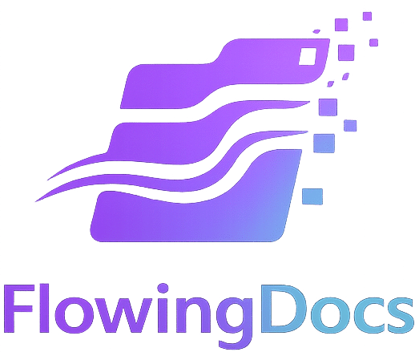

<div align="center">
  <a href="https://github.com/heywalter/flowingdocs">
    
  </a>

  <h1 align="center">FlowingDocs</h1>

  <p align="center">
    <strong>Technical Documentation & Knowledge Sharing</strong>
  </p>

  <p align="center">
    <i>"Knowledge flows, value grows."</i>
  </p>

  <p align="center">
    <a href="https://github.com/facebook/docusaurus">
      
    </a>
    <a href="./LICENSE">
      
    </a>
    <a href="https://creativecommons.org/licenses/by-nc/4.0/">
      
    </a>
    <a href="https://app.netlify.com/start/deploy?repository=https://github.com/heywalter/flowingdocs">
      
    </a>
  </p>
</div>

<br />

## 📖 About

**FlowingDocs** is a personal technical blog and documentation platform designed for **Technical Writing**, **Developer Experience (DX)**, and **AI-Assisted Creation**.

Built with the philosophy that knowledge should be fluid and accessible, this project serves as both a content repository and a technical playground for exploring modern documentation engineering.

## ✨ Features

- **🚀 Modern Tech Stack**: Built with [Docusaurus v3](https://docusaurus.io/), React, and TypeScript.
- **🎨 Beautiful UI**: Clean, responsive design with automatic Dark Mode support using TailwindCSS.
- **🔍 Full-Text Search**: Integrated **Algolia DocSearch** for instant content retrieval.
- **💬 Interactive Comments**: Powered by **Giscus** (GitHub Discussions) for community engagement.
- **📱 PWA Support**: Installable as a desktop/mobile app with offline reading capabilities.
- **🌍 Internationalization**: Native support for **i18n** (Chinese/English).
- **📊 Analytics**: Integrated Google Analytics 4 for visitor insights.

## 🛠️ Tech Stack

- **Framework**: [Docusaurus v3](https://docusaurus.io/)
- **Styling**: [TailwindCSS](https://tailwindcss.com/) & Custom CSS
- **Search**: [Algolia](https://www.algolia.com/)
- **Hosting**: [Netlify](https://www.netlify.com/)
- **Comments**: [Giscus](https://giscus.app/)

## 🚀 Getting Started

### Prerequisites

- Node.js (version 20.0 or above)
- pnpm (recommended) or npm

### Installation

1. **Clone the repository**
   ```bash
   git clone https://github.com/heywalter/flowingdocs.git
   cd flowingdocs
   ```

2. **Install dependencies**
   ```bash
   npm install
   # or pnpm install
   ```

3. **Start the development server**
   ```bash
   npm start
   # or pnpm start
   ```
   The site will open automatically at `http://localhost:3000`.

## 📂 Project Structure

```text
flowingdocs/
├── blog/             # Blog posts & authors config
├── docs/             # Knowledge base (structured docs)
├── data/             # Static data (features, friends, social)
├── i18n/             # Internationalization translations
├── src/
│   ├── components/   # Custom React components
│   ├── css/          # Custom global styles
│   ├── pages/        # Standalone pages (Home, About, etc.)
│   └── theme/        # Swizzled Docusaurus theme components
├── static/           # Static assets (Images, favicons)
├── docusaurus.config.ts  # Main configuration
└── tailwind.config.ts    # Tailwind CSS configuration
```

## 🤝 Contributing

Contributions are welcome! If you find a typo or want to improve a section:

1. Fork the project
2. Create your feature branch (`git checkout -b feature/AmazingFeature`)
3. Commit your changes (`git commit -m 'Add some AmazingFeature'`)
4. Push to the branch (`git push origin feature/AmazingFeature`)
5. Open a Pull Request

## 📄 License

- **Source Code**: Licensed under the [MIT License](./LICENSE).
- **Content**: Licensed under [CC BY-NC 4.0](https://creativecommons.org/licenses/by-nc/4.0/).

---

<div align="center">
  <p>Created with ❤️ by <strong>Walter Gui</strong></p>
  <p>
    <a href="https://github.com/heywalter">GitHub</a>
  </p>
</div>
