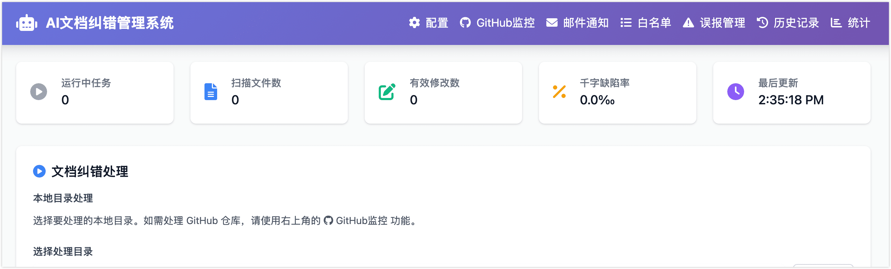
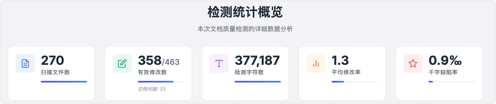
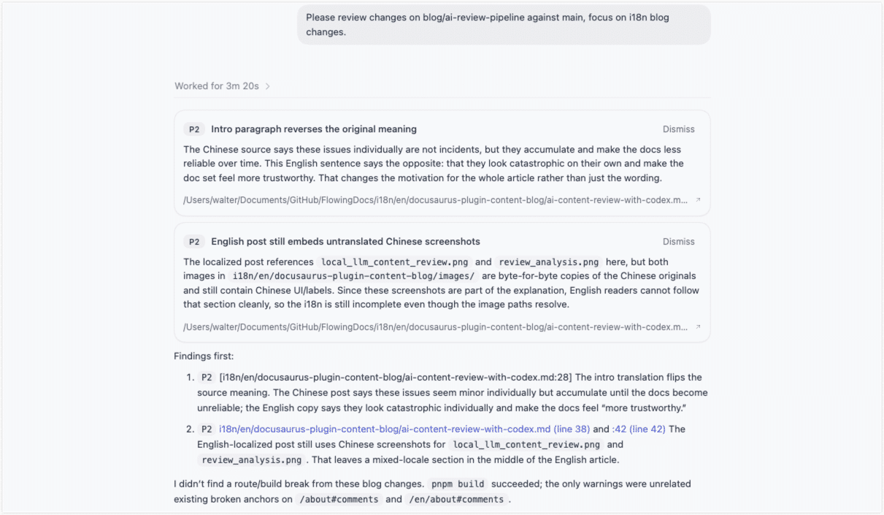
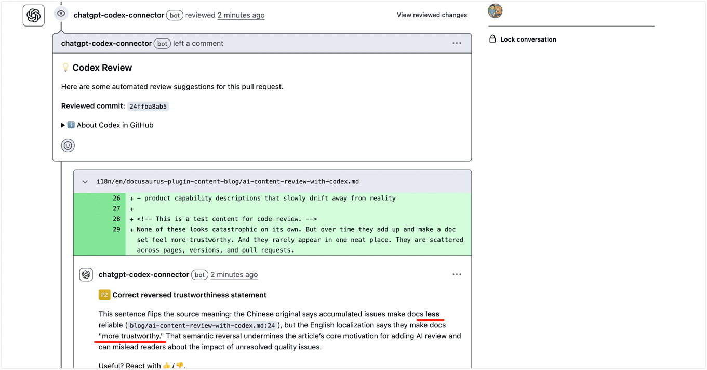

当技术文档全面采用 Doc-as-Code 并托管在 GitHub 之后，Review 流程也开始越来越像代码协作，面临越来越高的质量压力。过去半年里，我围绕文档审查做了一次比较完整的演进：先用本地轻量校验处理错别字和基础文本问题，再引入 Codex 的本地与云端 Code Review，并通过 `AGENTS.md` 把审查规则逐步沉淀下来，最终形成一套轻量、本地、云端三层配合的内容审查流程。

这篇文章想分享的，不只是工具体验，而是这套流程为什么值得做、怎么设计，以及它的边界在哪里。

<!--truncate-->

## 为什么要引入 AI 内容审查？

我们的技术文档采用 Doc-as-Code 方式，全部托管在 GitHub 代码仓库里，和产品代码一样通过版本控制来管理。这种方式的好处很明显：文档有历史、有分支、有评审，也能自然接入现有研发流程。但当文档规模开始变大之后，我们发现人工 Review 最先失守的，并不是那些特别复杂的技术错误，而是那些会反复出现、又很难靠人稳定抓住的小问题：

- 错别字和明显病句
- 内部链接、锚点、图片、导航栏引用失效
- 同一个术语在不同页面写法不一致
- 产品核心能力描述慢慢和真实情况脱节

这些问题单个看都不算事故，但一旦积累起来，文档质量就会慢慢变得不可靠。更麻烦的是，它们往往不会在一篇文档里集中爆发，而是散落在整个仓库的不同页面、不同版本、不同 PR 里。

这也是我后来开始认真思考更强 AI review 的原因：不是因为我觉得它能取代人，而是因为它正好填在一个很关键的位置上——比纠错小模型和规则更懂上下文，又比人工逐页检查更稳定、更高效。

## Codex 之前，本地 AI 纠错小模型内容校验

在引入 Codex 之前，我其实已经做过一轮更轻量的本地校验方式：基于开源模型配合垂直领域语料，持续训练专用的小模型，对技术内容进行批量审校。

这套方案的思路并不复杂。它不试图理解所有内容，而是优先去抓那些最基础、最高频、最容易规模化的问题：错别字、术语误写、明显病句，以及部分格式和表达异常。



它的优势非常明显：跑得快、成本低、适合整库扫描，而且规则可控。如下图所示，完成约 38 万字的整库扫描，耗时 60 多分钟，折算下来大约是每秒校验 100 字左右。



对于持续演进的文档仓库来说，这种方案的性价比其实很高。但它的边界也很明显：小模型和轻量规则更擅长的是表面质量，而不是内容正确性。它可以告诉你一句话里有错别字，却不一定能判断这句话虽然语法没问题，但会不会误导用户。它也可以发现术语写法不统一，却不一定能意识到某个功能支持表述已经和真实实现发生了偏离。

这也是我开始认真看待 AI review 的真正原因：不是因为它更智能，而是因为它在这种重复、细碎、分散、规模化的问题上，比人工更稳定，更适合作为人工审查之前的一层过滤，也能把精力释放到更有价值的工作上。

:::tip

由于本次主题不是本地 AI 小模型校验平台，如果您对这块平台构建感兴趣，欢迎留言，后面单独开一篇来详细介绍。

:::

## Codex 内容审校流程实践

### 什么是 Codex，为什么把它接入文档 Review

在前面的实践里，我们已经建立了一层本地轻量校验，用来快速发现错别字、术语误写和部分基础表达问题。但如果想进一步解决链接引用、上下文一致性、能力描述偏差这类更复杂的问题，仅靠轻量规则或小模型往往还不够。也正是在这个阶段，我开始把 Codex 接入到文档 Review 流程中。

Codex 可以简单理解为 OpenAI 提供的一套面向开发工作流的 AI 代理能力，既支持本地使用，也支持在云端接入 GitHub review 流程。从使用形态上看，它主要分为两类：

- **Codex Local**：运行在本地，覆盖 CLI、IDE 插件和桌面端工作流
- **Codex Cloud**：运行在云端，支持 GitHub 上的 Code Review

对文档审查来说，这两类能力刚好对应两个不同阶段：本地阶段更适合作者在编辑过程中做预检，尽早发现问题；PR 阶段则适合作为统一的保底检查。这样一来，即使部分贡献者本地没有安装 Codex，或者提交前没有手动跑 review，到了 PR 环节，仍然会有一层一致的自动审查，不需要把整个流程建立在每个人都先完成本地自查的前提上。


最终的内容审校流程如上图所示。第一层仍然是前面提到的本地轻量校验，负责以较低成本清理基础问题；第二层则是 Codex 这种更强的 AI review，用来检查轻量规则不擅长处理的部分，例如链接、锚点、sidebar 是否匹配，能力说明是否与其他页面或实现存在明显冲突，以及某些表述是否可能误导用户。

### 如何接入 Codex Cloud

接入方式本身并不复杂。首先，需要前往 [Codex Connector 管理页面](https://chatgpt.com/codex/cloud/settings/connectors)，连接 GitHub，并授权需要进行 Code Review 的仓库。


完成仓库授权后，还可以继续前往 [Code review 设置页面](https://chatgpt.com/codex/cloud/settings/code-review)，配置 review 的触发方式，例如是否自动对 PR 执行检查、是否对所有贡献者统一启用等。

到这里，Cloud 侧的接入就基本完成了。

### AGENTS.md 是什么，为什么要设计它

如果仅仅把仓库接入 Codex，还不足以让它真正适合文档 review。如果不给出明确规则，Codex 默认更像一个泛用的 code reviewer，而不是一个真正理解文档仓库约束的 reviewer。对文档仓库来说，这通常会带来两个问题：该报的问题没有被指出，不该报的问题却报了很多。

这里就要用到 `AGENTS.md`。

我们可以把 `AGENTS.md` 理解成一份提供给 Codex 的项目级说明文件。它的作用不是一份很长的写作规范，而是告诉 Codex：在这个仓库里，什么问题值得重点关注，什么问题可以忽略，哪些目录需要更严格的检查，哪些内容则应该更保守地处理。OpenAI 官方也建议把可复用、稳定的规则写进 `AGENTS.md`，并保持它简洁、准确、可持续迭代。

:::tip

在实际落地时，`AGENTS.md` 也不一定只有一份。Codex 会按目录读取规则，并在 review 时优先使用离当前改动文件最近的那份说明文件。因此，如果仓库结构比较简单，只在 `docs/` 下放一份 `AGENTS.md` 就足够；但如果仓库中还包含历史版本目录、复用内容或其他特殊子目录，就可以按目录分层放置，让不同类型内容使用不同的审查规则。

:::

所以在真正落地时，我更倾向于把 `AGENTS.md` 理解成一份 **review contract**，告诉它如何审。例如，在 `docs/AGENTS.md` 中，可以只保留那些长期稳定、反复会遇到的规则，部分文件内容如下：

```markdown
## Review 重点

- 当前产品能力、默认值、限制条件、UI 名称以当前版本为准；不确定时应标明未验证，而不是猜测。
- 操作步骤应写清前提、顺序和结果；涉及不可逆操作、权限、网络、费用或数据风险时，应有明确提示。
- 站内链接、标题锚点、相对路径、图片引用、文档 `id`（默认为文件名）与 sidebar 引用关系应保持一致。
- `docs/reuse-content/**` 中的内容可能被多页复用；review 这类改动时，要考虑下游页面是否也会受影响。
- `docs/images/**` 中图片的路径、大小写、扩展名应与引用保持一致。
```

如果仓库中还有历史版本目录，例如 `versioned_docs/`，也建议为它单独设计一份更保守的规则。因为历史版本文档最怕的不是表达不够新，而是把旧版本行为误改成当前版本行为。GitHub 中的 Codex review 默认更偏向高优先级问题，因此如果希望它连文档 typo、术语漂移这类问题也认真报出来，也需要提前通过 `AGENTS.md` 把这些检查定义清楚。

:::tip
当然，完整的 `AGENTS.md` 还包含更多内容，比如评审范围、仓库结构概览、Review 输出约定等，相关示例也可以参考[本仓库](https://github.com/heywalter/FlowingDocs) 的根目录和 i18n/en/AGENTS.md 中找到。
:::

## 如何在本地和 PR 阶段使用

完成流程接入和审阅规则设定后，这套流程就可以分别在本地和 PR 阶段使用。

**本地编辑阶段**

我们可以通过 Codex 的桌面端或 CLI 先做一轮预检，对当前改动尽早发现问题。如下图所示，可以在桌面端通过 `/code review` 发起任务并选择检查范围。


评审效果示例如下：




:::tip

本地 review 的优势在于更灵活，可以根据需求选择更快的模型做快速扫描，或者用更强的模型做更深入的审核。

:::

**PR 提交阶段**

当触发 PR 请求后，可以由 Codex Cloud 自动执行 review；如果没有开启自动检查，也可以在 PR 评论区手动通过 `@codex review` 触发。Cloud review 更适合作为统一的保底机制，因为它不依赖每位贡献者本地都安装并使用 Codex。

评审效果示例如下，可以看到评审的非常深入，连中英文内容不一致，以及英文文章包含中文图片都能检查出来。




需要注意的是，Codex Cloud 当前使用 **GPT-5.3-Codex**，并且默认只标记 **P0 和 P1** 问题。所以，如果希望它连文档 typo、术语漂移这类问题也认真报出来，就需要提前在 `AGENTS.md` 中把这些检查定义清楚。

综合来看，我更建议把两者搭配起来使用：本地 review 负责提交前的预检，可以根据改动复杂度选择合适的模型；Cloud review 则负责 PR 阶段的统一保底，避免遗漏。

从实际效果上看，这套流程最有价值的地方，并不是发现某一个大问题，而是能稳定识别那些人工最容易漏掉、却又会反复出现的问题。例如标题锚点已经变化，但页内链接仍然指向旧锚点；sidebar 条目引用的路径和页面实际路径不一致；某个能力说明已经更新，但其他页面仍然保留旧表述；或者历史版本内容被误改成当前版本语义。

对我来说，Codex 最值得做的，并不是替代人工，而是把文档 Review 从靠经验的人扫一遍，变成一个可分层、可配置、可复用、可持续优化的流程。

## 写在最后

回过头看，这套流程真正带来的变化，不只是多了一层 AI 工具，而是把文档审查这件事慢慢做成了一个系统：基础问题先在本地低成本过滤，复杂问题交给更强的 review 能力，再通过 `AGENTS.md` 把经验沉淀成规则。

它当然还不完美，轻量校验更擅长抓表面问题，Codex 更擅长看上下文和一致性，但最终的业务判断依然离不开人。也正因为这样，我越来越觉得，AI review 最有价值的地方，从来不是替代人工，而是把人工从重复、琐碎的检查里解放出来，让注意力回到真正值得判断的内容上。

如果您也在探索 AI 增强的内容审核，也欢迎交流您的做法。您更倾向于先用轻量规则做前置过滤，还是直接把更强的 AI review 接进 PR 流程？
