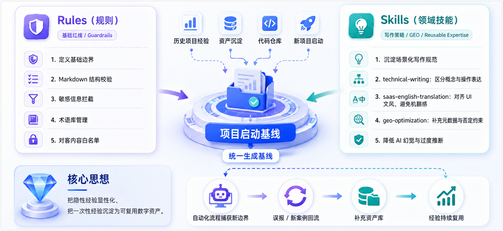
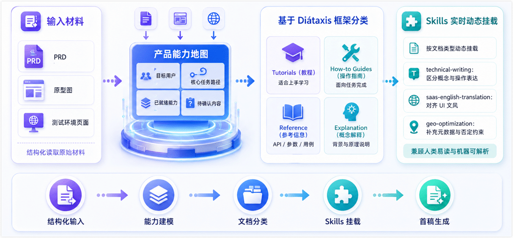
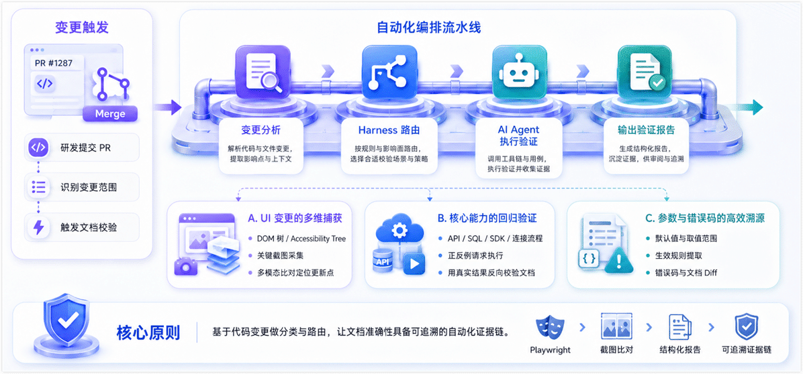

摘要：AI 大模型可以快速生成看起来完整的产品文档，但这些内容是否符合真实用户路径、是否经过验证、是否适合对外发布，仍然是一个高确定性问题。本文记录了一次真实的文档工程化实践：我们如何从单次 AI 聊天生成 + 人工修补，升级为由 Rules、Skills、验证 Harness 和人工审阅共同组成的可验证、可复用文档生产流。通过这套流程，文档团队不仅提升了复杂软件文档的对客质量，也进一步将工作重心从内容编写延伸到文档平台工程、知识结构设计和开发者体验优化。

<!--truncate-->

在本次的项目早期，面对繁杂的材料与紧迫的交付周期，产品与研发团队为了在内部快速对齐，率先尝试将 PRD、原型图和底层逻辑交给大语言模型，快速生成了一批初稿，在内部评审和沟通的场景下，这种单点试水的效率不错。

然而，当产品准备正式上线（GA）面向外部客户时，这批初稿被交到了文档团队手中，准备进行最终的对客发布。此时，深层问题开始浮现，由于原先采用的单篇投喂的模式本质上是碎片化的，模型容易沿用代码和 PRD 的实现视角，无法自然构建用户的理解路径，缺乏全局的渐进式披露，而且操作步骤/API 调用没有经过真实调用，可能给用户带来真实的使用风险。

我们最初也尝试过常规解法，比如编写更长的 Prompt，或安排专人逐篇人工校对。但面对大量配置参数和复杂的业务逻辑，纯靠提示词工程或人工排查很快触及瓶颈，AI 依然会不经意间编造配置项、弱化关键限制，甚至把内部实现细节包装成对客能力。

这迫使我们重新思考：问题不在于 AI 写不出好文档，而在于我们试图用一个松散的黑盒，去解决一个需要高确定性的工程问题。既然 AI 容易在边界上犯错，我们就需要先把边界和证据机制设计出来；既然过去的项目踩过很多坑，我们就不能每次都从零开始教它。

于是，我们决定暂缓大规模的内容生成，先退后一步，把团队过去积累的隐性经验显性化，作为约束后续所有生成动作的基石。

## 第一步：沉淀历史经验，建立生成基线

构建工作流的第一步，不是急着让 AI 写新文档，而是建立约束框架。

我们没有为新项目凭空设定规则，而是将团队在过去多个项目中总结的经验，转化为代码仓库中的两类核心资产，并作为新项目的启动基线：

- **Rules（规则）** ：定义基础边界，涵盖 Markdown 结构校验、敏感信息拦截、术语库、对客内容白名单等基础红线。
- **Skills（领域技能）** ：沉淀特定场景的写作规范与 GEO（生成式引擎优化）策略，从而更好服务读者与 AI 爬虫。例如，`technical-writing` 规范概念与操作的差异化表达；`saas-english-translation` 负责翻译时的文风，避免机翻并对齐 UI 文案；此外，配合 `geo-optimization` Skill，主动添加页面元数据、明确的否定声明（Negative Constraints），防止 AI 产生过度推断的幻觉。

当然，这些 Rules 和 Skills 也会随着项目的展开持续演进。例如，自动化流程捕获到新的边界情况或误报后，我们会将其反向补充到资产库中，让团队的经验变成可复用的数字资产。

## 第二步：受控的内容生成，从单点投喂到结构化组装

有了规则基线，我们摒弃了把一堆材料扔给 AI 自由发挥的模式，转而采用受控的结构化生成工作流。

1. **构建产品能力地图**
   在生成具体文档前，先让 AI 阅读 PRD、原型图和测试环境页面，输出产品功能点的结构化能力地图，作为后续内容生成的总纲，例如目标用户是谁、核心任务路径是什么、哪些能力已就绪、哪些内容仍需确认。
2. **基于 Diátaxis 框架分类**
   根据能力地图，参考 [Diátaxis 框架](https://diataxis.fr/)（Tutorials, How-to Guides, Reference, Explanation）将任务拆解为概念、教程、操作指南和参考信息等不同类型。生成概念时关注业务背景，生成操作时挂载真实截图和预期结果，生成参考时对齐后续 Harness 验证通过的 API、参数或用例。
3. **Skills 实时动态挂载**
   在每一次生成任务中，我们会根据文档类型显式挂载对应的 Skills，让生成内容从第一稿开始，就尽量符合人类易读与机器可解析的双重标准。

## 第三步：自动化编排，让文档迭代具备确定性

内容生成只是起点，确保文档在持续迭代中保持准确，才是工程化的核心。

为了实现这个目标，我们将代码变更也纳入文档触发机制：当研发提交 PR 时，系统可以分析变更范围，并自动路由到对应的验证 Harness（借鉴了软件工程中 Test Harness 测试线束的理念）。由 AI Agent 自动执行验证任务并输出报告。以复杂的软件类产品为例，这套机制可以覆盖以下场景：

- **UI 变更的多维捕获**
  由于产品界面迭代频繁，纯靠人工比对极易遗漏，为此，我们建立了 UI 与文档的映射基线，当页面结构、路由或关键文案代码发生变化时，自动触发验证。结合 Playwright 真实登录产品进行操作，采集 DOM 树、Accessibility Tree 和关键截图，再交由 AI 与历史文档进行多模态比对，精准定位需要更新的路径和描述。
- **核心能力的回归验证**
  当识别到 API 签名、参数或底层逻辑变更时，AI Agent 会调用测试实例，执行预设的正反例请求。利用真实的运行结果，反向验证当前文档中的接口描述、参数边界和错误处理是否依然可信。同样的思路，也能用于验证数据库 SQL、SDK 示例代码或连接配置流程。
- **参数与错误码的高效溯源**
  当配置类注解或异常抛出逻辑发生变化时，系统会从源码或规范文件中提取最新的默认值、取值范围、生效规则及错误码，直接与文档描述进行 Diff。这极大减少了人工抄写带来的滞后与偏差。

当然，具体的验证逻辑需要根据不同产品的特性定制，但其核心原则是不变的：基于代码变更做分类与路由，让文档的准确性校验从纯人工抽检，逐步升级为基于运行结果的自动化证据链。

## 流程固化后，文档工程师的价值体现在哪里？

当 Rules、Skills、Harness 和执行边界逐渐固化，基础的生成与校验被系统承担，文档工程师的价值不仅没有被削弱，反而变得更靠前、更具工程属性。

过去，我们关于自动化校验的好想法常受制于代码能力；如今，AI 辅助编程抹平了这道门槛，让我们能直接将隐性经验转化为可运行的工具代码。我们的工作重心，正从内容交付者向以下三个高价值象限转移：

- **构建可复用的文档质量基础设施**
  将对文档场景的理解转化为自动化的防线，把踩过的坑固化为 CI/CD 管道中的验证 Harness，让内容质量不再完全依赖发布前的人工抽检。
- **面向人与机器的双重知识架构设计（GEO 实践）**
  AI 时代的文档也是 RAG 系统和 AI 助手的“语料”。我们需要通过严格的标题层级、一致的术语表、前置的限制说明以及标准的 Problem-Cause-Solution 结构，降低 AI 问答的幻觉，实现生成式引擎优化（GEO）。
- 把控对客边界，反推产品体验闭环（DX）
  AI 擅长堆砌信息，但无法替代业务敏感度。我们需要判断哪些内部细节应隐藏、哪些复杂 API 会带来误解。同时，将编写 Harness 时发现的模糊错误码或不友好流程，直接反馈给研发，把文档侧的反馈链路前置，成为提升开发者体验（DX）的核心推动力。

总之，AI 没有让我们退到流程末端，而是赋予了我们用工程化思维重塑文档工作流的能力，让我们真正成为内容规则设计者与知识架构师。

## 未竟之事与下一步演进

工程化永远在路上。目前我们虽然构建了基础的验证闭环，但仍有几个核心方向正在推进：

- **从发现错误到推荐规则**：目前排障后仍需人工更新规则，后续我们需要 Agent 根据失败报告，自动反向推导并生成 Rules/Skills 的更新建议，人工只需 Review 并合并。
- **从单点验证到链路验证**：目前的 Harness 多聚焦单点 API、UI、SQL 参考等，未来将尝试在沙箱中模拟业务全链路（如：创建资源 → 触发任务 → 状态断言），验证复杂教程的端到端准确性。
- **从本地分析到沙箱归因**：对于高风险操作（如删除资源、全局配置）或复杂的 SDK 编译错误，将其抛入隔离的云端沙箱中复现。Agent 在沙箱内收集日志并整理修复建议，做到安全与效率兼顾。
- **从构建侧验证到消费侧反馈**：探索在对客站点引入搜索词、高频错误码等遥测数据。在做好脱敏合规的前提下，将用户的真实阻点自动转化为文档的优化 Issue。

无论系统如何演进，边界必须清晰，模型只负责差异分析与建议，敏感凭证绝不入库，最终内容是否需要修改的决定权，始终留在文档工程师手里。

## 结语

回顾这次实践，我们对文档即代码（Docs as Code）有了更具象的体感。

将 AI 引入文档工程，绝不仅仅是换一个更聪明的写作工具，而是让知识生产真正具备工程化的确定性。模型确实压缩了写草稿的时间，但它更深层的价值，是倒逼我们重新审视业务：哪些隐性经验可以被结构化？哪些事实断言能够被自动化验证？

当繁琐的文字搬运与格式校验被系统接管，文档工程师终于可以将精力倾注于那些真正需要人类智慧的环节：洞察用户心智、设计信息架构、定义验证标准、把控对客边界。

AI 正在从文本生成器进化为可执行的 Agent，但这一跨越离不开 CI 管道、Guardrails（护栏）、沙箱和 Human Review 的严密配合。在这个过程中，我们把经验转化为规则，把猜测转化为证据，用系统的确定性去对冲大模型的随机性。

最终，我们不再只是写文档，而是用工程化的手段，让文档像现代软件一样被构建、测试、审阅与持续进化。

## 延伸阅读

- [技术文档 AI 审核实践：从本地轻量校验到 Codex Code Review](./ai-content-review-with-codex.md)：结合本地小模型 LLM 轻量校验、Codex Local 与 Codex Cloud，分享一套适用于 Doc-as-Code 技术文档的 AI 审校流程，以及 AGENTS.md 规则设计的落地经验。
- [从零构建本地 AI 内容审校系统：小模型推理到工程化落地](./building-a-local-ai-content-review-system.md)：从技术文档审校中的错别字、术语误写和误报问题出发，分享一套本地中文 AI 文档纠错系统的设计思路，包括规则引擎、小模型、保护机制、Web 管理界面和持续反馈。
- [Diátaxis](https://diataxis.fr/)：从用户需求区分 tutorials、how-to guides、reference 和 explanation 的经典信息架构理论。
- [Google developer documentation style guide](https://developers.google.com/style/)：开发者文档的语气、术语、格式和项目优先原则。
- [Docusaurus documentation](https://docusaurus.io/docs)：Markdown / MDX 文档站点的构建、版本化和国际化工程。
- [Vale documentation](https://vale.sh/docs)：将术语、风格与 Prose Lint 规则彻底工程化的开源方案。
- [OpenHands (formerly OpenDevin)](https://github.com/All-Hands-AI/OpenHands)：了解 AI Agent 如何在隔离沙箱中执行复杂软件工程任务的开源实践。
