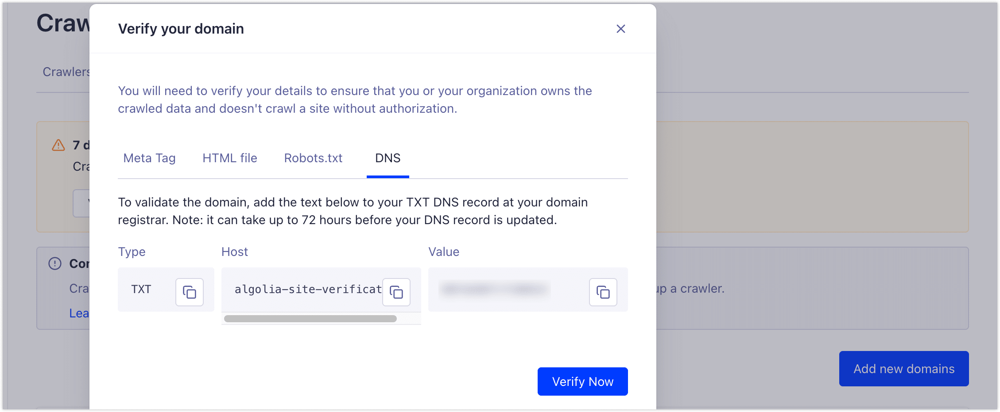
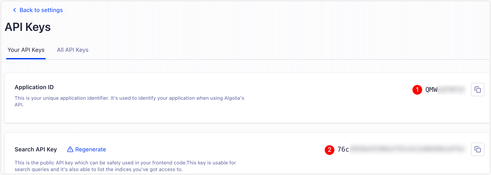
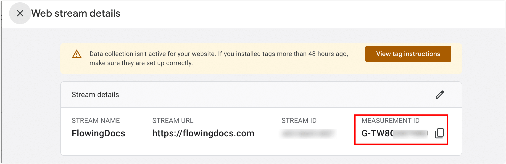
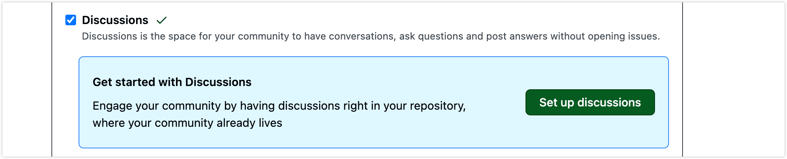
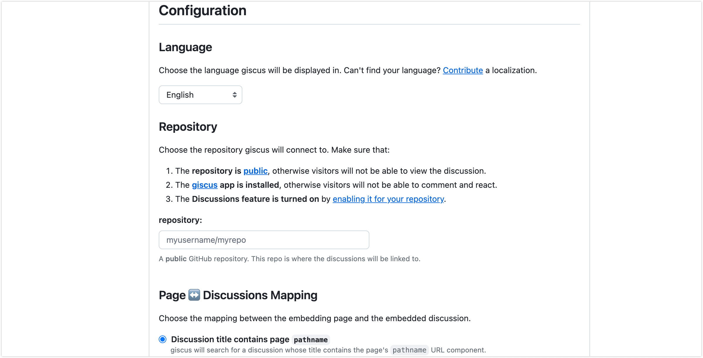
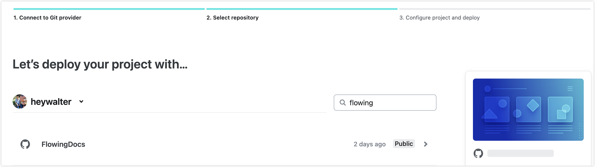

挑静态博客框架期间，对比看过 Hexo、Hugo 等主流方案，最后定了 Docusaurus，主要是刚好满足了几个需求：偶尔写点技术内容、想把博客和文档放在一起、又不打算为了样式从头写 CSS，积累的经验也可以复用至工作中的技术文档项目。

从 Fork 模板开始，到改成现在这个样子，前后断断续续一两周。这篇文章把整个过程整理一遍，省得自己以后忘了，也给打算自己搭一个的朋友做个参考。完整代码在这里：[heywalter/FlowingDocs](https://github.com/heywalter/FlowingDocs)，欢迎 Fork 或 Clone 直接复用，然后按照本文的步骤把站点信息和外部服务凭证换成自己的就能跑起来。

<!-- truncate -->

## 为什么是 Docusaurus

前面提到的主流方案试了一圈下来，挑它主要是几点：

- **写作体验好**：Markdown 和 MDX 都原生支持，写文章想插一段 React 组件做点交互，不需要额外配置。
- **主题完成度高**：亮暗模式、响应式布局、目录侧栏开箱就有，不必从零调样式。
- **插件生态够用**：搜索、评论、PWA、图片放大这些常见需求都有成熟插件方案，按需安装即可。
- **大厂背书稳定**：Meta 自家在用——React 官方文档就是 Docusaurus 写的，Star 数和活跃度都高，不必担心哪天突然没人维护。
- **经验复用工作**：Docusaurus 是许多企业开发者门户和技术文档的标准选型。在个人博客上踩过的坑、积累的文档工程化经验，可以直接复用到工作项目中。

如果您的工作也涉及技术内容，或者希望博客和文档结构都能兼顾，这套基本是目前稳妥的选择。

接下来，我们介绍下这个博客项目的整体配置流程。

## 项目初始化

确保本地装了 Node.js（v18 或更高），然后用官方脚手架起一个项目：

```bash
npx create-docusaurus@latest my-blog classic
cd my-blog
npm start
```

跑起来之后浏览器打开 `http://localhost:3000`，能看到默认样子就算成功。

:::tip
不想从空模板开始的话，直接 fork 或 clone [我的仓库](https://github.com/heywalter/FlowingDocs)，然后记得删除我的文档信息，并将下面的配置换成您自己的，否则评论、统计数据会跑到我这边，具体每一项怎么申请、放哪里，下面会逐个讲。

- `docusaurus.config.ts` 里的 `title`、`url`、`organizationName`、`projectName`、`favicon`、导航栏页脚链接等站点信息
- Algolia 的 `appId`、`apiKey`、`indexName`
- Google Analytics 的 `trackingID`
- Giscus 的 `repo`、`repoId`、`categoryId`
- Netlify 的部署仓库和域名

:::

## 站点基础配置

所有站点级的设置都集中在 `docusaurus.config.ts` 这一个文件里，开头几个字段就是站点的身份信息：

```typescript
const config = {
  title: 'Flowing Docs',           // 浏览器标签和导航栏显示
  tagline: '技术笔记与思考',         // 副标题，出现在首页和导航栏下方
  url: 'https://flowingdocs.com',  // 部署后的完整域名
  baseUrl: '/',                    // 部署路径，根目录就是 '/'
  favicon: 'img/favicon.ico',      // 标签页那个小图标，建议 32x32 ICO
  // ...
};
```

`url` 和 `baseUrl` 一定要按真实部署情况填，不然生成出来的链接全是错的。

## 导航栏与页脚

导航栏放 logo 和顶部入口，常见的就是博客、文档、关于这几个，可以定义其位置在导航栏的左侧或右侧：

```typescript
navbar: {
  logo: {
    alt: 'Flowing Docs Logo',
    src: 'img/logo.webp',
  },
  items: [
    { to: '/blog', label: '博客', position: 'left' },
    { to: '/docs/intro', label: '技术文档', position: 'left' },
    { to: '/about', label: '关于我', position: 'right' },
  ],
},
```

页脚我习惯分两栏：左边放学习相关的链接，右边放社交账号，再加一行版权：

```typescript
footer: {
  style: 'dark',
  links: [
    {
      title: '学习资源',
      items: [
        { label: 'Docusaurus 官方文档', href: 'https://docusaurus.io' },
        { label: 'React 官方文档', href: 'https://react.dev' },
      ],
    },
    {
      title: '社交链接',
      items: [
        { label: 'GitHub', href: 'https://github.com/heywalter' },
        { label: 'Twitter/X', href: 'https://twitter.com/heywalter' },
      ],
    },
  ],
  copyright: `Copyright © ${new Date().getFullYear()} Walter. Built with Docusaurus.`,
},
```

SEO 元数据、社交媒体分享图等更细的东西也都在这个文件里，结构很直白，对着官方文档翻一翻就能配。全局样式（字体、配色等）写在 `src/css/custom.css` 里，亮暗两套主题用 CSS 变量就能统一管理。

界面骨架立起来之后，下一步是把搜索、数据分析和评论这三样接进来——文章一多，这三个基本就成了刚需。

## Algolia DocSearch：站内搜索

文章一多，没搜索就不太能用了。Algolia 的 DocSearch 是 Docusaurus 官方推荐方案：免费、索引快、模糊匹配和高亮都做得不错。

:::tip
如果博客刚上线还没申请到 DocSearch 凭证，可以先用 `docusaurus-search-local` 这个本地搜索插件顶一下，等审核通过再切回去。
:::

Algolia 的免费额度分两档：

- **普通 Build 计划**：注册就有，约 10K 搜索/月、1M 条记录、10K 抓取/月，小博客够用但不算宽裕。
- **DocSearch 专属计划**（推荐）：约 50M 搜索/月、5M 条记录、5M 抓取/月，还附带专属 crawler，专门给开源/技术文档准备的。申请门槛和流程见 [DocSearch 官方文档](https://docsearch.algolia.com/docs/who-can-apply)。

申请提交后 1-3 个工作日会有结果，操作界面大概是这样：


通过之后会收到邮件，里面有引导链接：


接下来登录 Algolia Dashboard，按引导走，或者手动找到左下角 **Data Sources → Crawler**，先做域名所有权验证：



域名验证完，开始配 Crawler 和索引——抓取这一步是 Algolia 服务器在跑，不占自己的资源。Docusaurus 有官方预设模板，选了之后基本不用再调，默认每周自动重新抓一次。

点 **Setup Crawler**，填 Crawler 名称和站点域名，类型选 **Technical documentation**，模板选 **Docusaurus v2.x or 3.x**，**Create**：


第一次构建可能跑不完——因为站点还没接 Algolia 的认证。先去左侧 **Indices** 记下索引名，再去右上角 **Settings → API Keys** 拿到 `appId` 和 `Search API Key`：



把这三个值填进 `docusaurus.config.ts`：

```typescript
algolia: {
  appId: 'YOUR_APP_ID',
  apiKey: 'YOUR_SEARCH_ONLY_KEY',
  indexName: 'YOUR_INDEX_NAME',
},
```

部署上线之后，回到 Crawler 页面手动重跑一次索引，几分钟后再到站点上试搜索框，能搜到内容就说明全链路通了。

:::tip
手上有自己服务器的话，也可以自建 Crawler 定时跑索引——好处是更可控。具体步骤见 [官网文档](https://docsearch.algolia.com/docs/legacy/run-your-own)。
:::

## Google Analytics：访问数据

文章发出去之后总会想知道有没有人看、看了多久、从哪儿来的，Google Analytics 4 是最常用的免费方案，接入也很简单。

登录 [Google Analytics](https://analytics.google.com/) 后台，左下角齿轮图标 **管理 → Data streams → Create stream**，类型选 **Web**，填站点域名，提交就能拿到衡量 ID（`G-XXXXXXXXXX` 格式）：



把 ID 填进配置里就行：

```typescript
gtag: {
  trackingID: 'G-XXXXXXXXXX',
  anonymizeIP: true,  // 启用 IP 匿名化，更尊重隐私
},
```

部署后等几个小时，GA 后台就有实时数据了。

## Giscus：基于 GitHub Discussions 的评论系统

之前用过 Gitalk，问题是它基于 GitHub Issue，每写一篇文章就生成一个 Issue，时间一长仓库里全是悬空的 Issue 列表，看着很别扭。后来换成 Giscus，同样基于 GitHub，但走 Discussions，显得干净多了，还支持 Markdown、邮件提醒，对开发者很友好。

:::tip
博客仓库必须是 Public，不然访客看不到 Discussion，评论区会直接加载失败。
:::

接入分三步。

**第一步**，进 GitHub 上博客仓库的 **Settings**，往下翻到 **Features**，勾上 **Discussions**：



**第二步**，安装 [Giscus GitHub App](https://github.com/apps/giscus)，点 Configure，把博客仓库授权给它：


**第三步**，去 [giscus.app](https://giscus.app) 配生成器：

- **语言**：按需选择
- **仓库**：填 `用户名/仓库名`，比如 `heywalter/FlowingDocs`
- **页面与 Discussion 映射关系**：默认 `pathname`，每篇文章按路径绑一个独立讨论
- **Discussion 分类**：建议选 `Announcements`，并把权限设为"只有维护者可以创建讨论"——这样新文章发布时由您自动创建讨论，读者只能回复，避免被刷
- **特性、主题**：按个人喜好勾，比如把评论框放在顶部



页面底部会自动生成一段 script 代码。我项目里有一个自定义的 `Comment` 组件（在 `src/components/Comment`），已经处理了主题切换和多语言适配，所以只需要从生成的代码里挑出 `data-repo-id` 和 `data-category-id` 这两个值，填进配置：

```typescript
giscus: {
  repo: 'heywalter/FlowingDocs',
  repoId: 'R_kgDOQ3IAyQ',                        // data-repo-id
  category: 'General',
  categoryId: 'DIC_kwDOQ3IAyc4C02fd',            // data-category-id
  theme: 'light',
  darkTheme: 'dark_dimmed',
},
```

:::warning
fork 或 clone 我的仓库的话，记得把 `repoId` 和 `categoryId` 换成自己的，不然评论会跑到我的 Discussions 里。
:::

## 几个值得装的插件

Docusaurus 的插件机制很灵活，按需安装即可，下面这几个是我用下来觉得比较实用的：

- **图片点击放大** — [docusaurus-plugin-image-zoom](https://github.com/gabrielcsapo/docusaurus-plugin-image-zoom)，技术博客避免不了截图、架构图，默认情况下图片只能原尺寸看，开了这个之后点一下就能放大看细节，写图多的文章很有用。
- **响应式图片** — [@docusaurus/plugin-ideal-image](https://docusaurus.io/docs/api/plugins/@docusaurus/plugin-ideal-image)，自动给每张图生成多种分辨率，按设备和网络选择合适的版本加载，首屏速度肉眼可见地变快。
- **PWA** — [@docusaurus/plugin-pwa](https://docusaurus.io/docs/api/plugins/@docusaurus/plugin-pwa)，让博客可以"安装"到手机主屏幕、支持离线阅读，移动端体验提升明显。
- **站点地图** — [@docusaurus/plugin-sitemap](https://docusaurus.io/docs/api/plugins/@docusaurus/plugin-sitemap)，自动生成 `sitemap.xml`，方便搜索引擎抓取，对 SEO 有帮助。

更多可选项见 [官方插件库](https://docusaurus.io/docs/api/plugins) 和 [社区插件库](https://docusaurus.io/community/resources#community-plugins)。

功能齐备后，最后一步是把站点部署上线。

## 部署上线：Netlify

我采用的是 Netlify，因为它跟 GitHub 联动地非常棒，本地修改 Push 到主分支自动部署、PR 自动生成预览链接、HTTPS 证书自动管理，完全不用自己维护服务器，而且免费额度也够大方——100GB 带宽、每月 300 分钟构建时间，作为个人博客基本是用不完的。

其中的 PR 预览这个功能我特别喜欢：每次发新文章前先开 PR，Netlify 会给一个独立的临时链接，自己或者发给朋友先看一眼、确认没问题再合，比直接推到线上稳妥得多。

接入流程非常简单，先去 [Netlify GitHub App 安装页](https://github.com/apps/netlify/installations/select_target)，把博客仓库授权给 Netlify。

然后登录 [Netlify 控制台](https://app.netlify.com/)，点右上角 **Add new project → Import an existing project**，选 GitHub，授权后挑到博客仓库：



Netlify 会识别出这是 Docusaurus 项目，自动填好构建配置，确认这两项没问题就行：

- **Build command**：`npm run build`
- **Publish directory**：`build`

确认完点 **Deploy site**，几分钟后就能通过 `your-project-name.netlify.app` 这个临时域名访问到。

**绑自定义域名**

走 **Domain management → Add custom domain**，填上自己的域名。Netlify 提供两条路径：

- **外部 DNS**：在域名注册商那边把 CNAME 指向 Netlify 给的值，简单粗暴。
- **Netlify DNS**：把 NS 整体托管给 Netlify，配置更省心，也能用上 Netlify 的 CDN 优化。

不管选哪种，HTTPS 证书都是 Netlify 自动签发和续期，不用自己折腾 Let's Encrypt。

至此整个站点就上线了：HTTPS 自动管、图片自动优化、PWA 移动体验、PR 预览、push 即部署，写文章只管写就行，发布流程基本不用操心。

## 写在最后

整套配置看下来好像东西不少，其实大部分都是围绕 `docusaurus.config.ts` 进行配置，操作配置都是一次性的，后续就可以将精力全放在写作上，无需维护任何服务器。

后续如果有新坑或者该架构下的实践经验，也会持续分享，如果用起来有问题也欢迎在评论区留言，感谢您的阅读。
