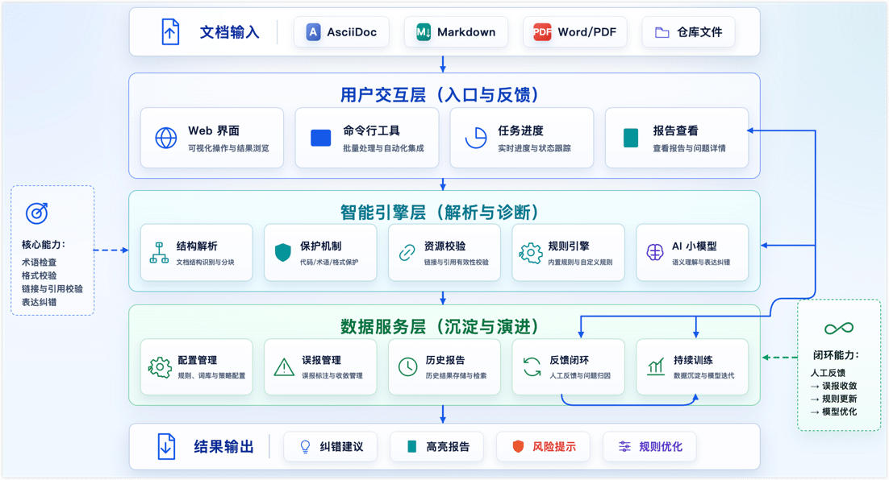

上一篇文章[《技术文档 AI 审核实践：从本地轻量校验到 Codex Code Review》](/blog/ai-content-review-with-codex)中，我简单提到过，在引入 Codex 做更深入的内容 Review 之前，我先做过一套本地 AI 文档纠错系统，用来处理错别字、术语误写、基础病句和部分格式异常。

当时只是顺手带了一句，没想到有读者对这块更感兴趣。所以这篇文章就单独展开聊聊：为什么要做一个本地中文 AI 文档纠错系统，它和直接调用大模型有什么区别，以及从一个能跑的 Demo，到一个团队里真的能用的 Web 工具，中间需要补上哪些工程设计。

<!--truncate-->

## 先确认预期再设计

如果只是粗暴地把技术文档丢给 AI 大模型，极易引发破坏标记语法、误改代码块等意外灾难。因此，这套系统的核心设计理念是通过工程化手段（如语法解析、结构保护），可控地利用 AI 扫除基础错误，将我们的人工 Review 从大量重复性检查中释放出来。

它更像是文档发布流程前的一层轻量级质量过滤，专注于以下基础指标：

- 能快速发现错别字、重复词、术语误写和明显表达问题
- 能识别 Markdown、AsciiDoc、代码块、配置片段等技术文档结构
- 能通过白名单和保护规则避免误伤技术术语
- 能把处理进度、修改建议、报告和配置统一管理
- 能通过用户反馈持续沉淀误报规则、领域词表和训练样本

开始之前，先瞅瞅大概长什么样子，免得太枯燥了：

:::tip

- 这套本地系统并不是孤立存在的，正如我们在[前文](./ai-content-review-with-codex.md)中提到的，它主要作为文档发布流程中的第一道轻量级防线，更深度的上下文一致性、逻辑结构以及双语翻译校验，依然会交由大模型（如 Codex）在后续的 PR Review 环节完成，两者互为补充。
- 目前这套系统还在内部整理和脱敏中，后续会优先将核心能力以开源项目或示例仓库的形式发布，方便有类似需求的团队参考和二次开发。

:::

## 为什么不直接用通用大模型？

最开始我也想过，既然大模型已经很强了，为什么不直接把文档丢给 ChatGPT 或其他云端模型做审校？

实际试了一段时间之后，会发现这里面有几个绕不过去的问题。

第一是成本。单篇文档调用一次看起来不贵，但技术文档通常不是一篇两篇，而是一整个仓库、一批 PR、多个版本反复扫描。如果每次基础错别字检查都走云端大模型，成本会随着文档规模线性增长。

第二是数据边界。技术文档里经常会出现未发布功能、内部架构、客户场景、配置示例和排障信息。即使云服务本身有完善的安全承诺，团队内部也往往需要先确认哪些内容可以外发、哪些内容不适合外发。对基础纠错来说，能在本地解决就尽量在本地解决，流程会简单很多。

第三是稳定性。文档 Review 是发布链路的一部分，如果每次都依赖外部网络和外部服务，遇到网络波动、额度限制、接口变化时，整个流程就容易卡住。本地小模型虽然能力边界更窄，但可控性更强。

最后也是最重要的一点：基础问题不一定需要最强模型。像重复词、常见错别字、术语误写、空格和标点问题，用规则和小模型组合处理，往往已经足够。把更强的 AI review 留给链接、上下文一致性、能力描述偏差这类更复杂的问题，整体性价比更高。

## 技术文档纠错和普通文本纠错的区别

做中文纠错时，很容易先想到把句子改通顺，但技术文档的问题在于，它不是纯自然语言文本，一篇技术文档里可能同时包含这些内容：

- Markdown 或 AsciiDoc 标记
- YAML、JSON、SQL、Shell 等代码块
- API 名称、参数名、配置项和错误码
- 中英文混排的产品术语
- 图片路径、站内链接和标题锚点
- 命令行输出、日志片段和配置示例

如果模型只是按普通中文文章去纠错，就很容易好心办坏事，比如把 `API 网关` 改成 `API 网管`，把代码注释和代码本体混在一起改，或者把 Markdown/AsciiDoc 语法结构改坏。

所以这套系统从设计之初，就要考虑到一些工程化的问题，比如：

- 哪些内容可以交给模型判断？
- 哪些内容必须保护起来，绝对不要改？
- 模型给出的建议如何被人确认、追踪和反向学习？

## 架构设计：从单点校验到自我进化的闭环演进

最早的验证只是一个命令行脚本：输入一段文本，输出纠错结果，通过这种方式快速跑通模型和验证 MVP 可行性，但离团队可用还差很远。

真正的难点不只是让模型改对几个错别字，而是如何在保证纠错准确性的同时，让系统具备可维护、可扩展和可审计的能力。

因此，这套系统没有停留在一次性的脚本验证上，而是逐步演进为一套持续性的质量保障流程：先解析文档结构，识别并保护代码块、配置项、链接、图片路径等敏感片段；再通过规则引擎和小模型协同诊断基础问题；最后通过报告、误报反馈和规则沉淀，形成可以持续优化的闭环。

### 1. 智能引擎层：解析、保护与混合诊断

本层级主要负责拆解技术文档中的不同元素，保护技术内容的结构，同时为后续的诊断提供基础。

**第一步：结构解析与保护机制**：技术文档纠错首先处理的不是句子，而是**结构**，系统会根据文件类型（如 Markdown/AsciiDoc）将文档拆解，识别出不同的元素（如标题、段落、代码块、图片等），配合保护机制，确保模型不会改变技术内容的结构。

- **默认跳过**：围栏代码标记、YAML/JSON 配置等。
- **局部保护**：行内代码、命令路径、API 参数名、以及链接和图片地址。
- **结构锁定**：不破坏标题、表格和提示块（Admonitions）的 Markdown 语法。

**第二步：资源有效性校验**：内容质量不仅关乎文字表达，还包括依赖资源的可达性，因此引擎在解析出结构后，会并行进行一轮轻量级的资源校验：

- **断链检查**：解析文档中的所有内外部链接，验证其是否能正常访问（如是否存在 404 或域名解析失败）。
- **图片破图检查**：检查本地相对路径的图片文件是否存在，以及图床上的外链图片是否有效，避免出现尴尬的“破图”。

**第三步：规则与小模型混合诊断**：剥离出安全的纯文本后，交由两个引擎协同工作：

- **规则引擎（处理确定性问题）**：负责明确、高频的问题，如重复词、标点空格、固定术语拼写，速度快、结果稳定，误判可控。
- **AI 小模型（处理语义问题）**：负责上下文搭配不当或规则难以覆盖的表达问题。我先后测试了 `chinese-text-correction-1.5b`、`ChineseErrorCorrector3-4B` 等模型，在系统中集成这些模型进行准确度测试，选型标准是在技术文档场景的误报率、响应速度和部署成本之间寻找平衡，预估仅需 RTX 3060（12 GB）或类似的算力资源即可。

:::tip 延伸阅读：打造低成本算力实验室

得益于小模型的轻量化，这套系统的原型开发和运行完全建立在我的**家庭 AI 实验室**（基于普通家用设备 + PVE 虚拟化环境构建）之上，如果你对如何用低成本打造一套个人专属的算力实验室感兴趣，欢迎在评论区留言，后续我也会单独写一篇文章来填坑分享！

:::

### 2. 数据服务层：误报管理与反馈闭环

中文 AI 纠错最容易让人失去耐心的地方是**误报**。如果系统总是对内部正确的术语报错，用户很快就会弃用。因此，误报管理和反馈闭环是系统从“Demo”走向“质量工具”的关键。

**误报管理：定义团队的写作边界**

- **白名单**：产品名、组件名、缩写等直接放行，即使模型认为它“不像正确中文”。
- **强制修复规则**：针对历史上反复写错的内部术语，配置为确定性替换规则。
- **误报过滤**：将用户在界面中拒绝的建议沉淀为过滤规则，降低下一轮的噪音。

**反馈闭环：把每一次操作变成训练数据**
系统不只是提供“接受/拒绝”按钮，而是将操作记录为包含上下文、模型建议和最终采纳结果的结构化样本。这些数据有两个核心用途：

1. **快速调优**：高频误报直接转入白名单或规则，第二天见效。
2. **周期性微调（Fine-tuning）**：积累足够多“人希望怎么改”的真实样本后，对本地小模型做领域微调。训练目标不是让模型变成“通用中文老师”，而是让它更懂当前团队的特定语境（例如降低特定技术表达的置信度阈值）。

### 3. 用户交互层：降低使用门槛

在开发初期，通过命令行的方式快速验证核心能力和想法是否可行，要面向更多受众的时候该方式就不适合技术写作者和产品同学。为此，我基于 Flask 和 Tailwind CSS 开发了一个轻量级的 Web 界面（本地 `python start_web.py` 即可拉起）。

Web 界面主要解决四件事，让工具顺手好用：

- **可视化操作**：输入待审阅的文档目录或上传文件，选择配置（调试模式、生成报告），一键扫描。
- **实时反馈**：提供进度条、实时日志，以及常驻的四项核心指标（扫描文件数、有效修改数、千字缺陷率等）。
- **配置管理**：跳过模式、白名单、提示词等配置收纳在弹窗中，支持界面编辑与保存。
- **报告反馈**：处理完成后，直接在浏览器中查看 HTML 格式的差异对比、文件级缺陷分布，支持误报反馈与训练数据生成。

## 容易被忽视的工程细节

除了宏观的三层架构，将本地小模型真正融入业务系统，还需要处理好以下几个非常现实的工程细节，提升稳定性与效率：

- **资源优化：模型懒加载**：避免 Web 服务启动时直接吃满显存。平时仅保持轻量服务在线，任务发起时才按需加载模型。
- **环境稳定：依赖严格固化**：AI 依赖库（如 `transformers`）极易更新不兼容，推荐锁定核心版本，并配置降级策略以防运行时崩溃。
- **流程健壮：批量解析容错**：面对成百上千个文档的扫描，个别文件的解析失败绝不能中断全局任务。错误应被直接隔离并记录日志。
- **价值闭环：报告驱动演进**：扫描报告不应只列出建议，更要直观暴露缺陷分布，提供一键反馈机制。用户的采纳与拒绝将直接沉淀为高质量样本，为后续小模型的持续微调（Fine-tuning）提供养料。

## 和 Codex Review 的关系

正如文章开头所说，这套本地纠错系统并非质量保障的最终解决方案，我们对它的核心定位是第一道轻量级防线，负责过滤基础、高频、极易被忽略的重复性问题。

当它扫清了错别字、格式错乱等噪音后，更深入的逻辑审查任务，则交给 Codex 这类更强大的 AI Review，专注于上下文一致性、逻辑自洽和多语言对齐。

因此，我目前的最佳实践是将文档 AI 审校明确分层，保障整体审校任务的效率和准确性。

- **预检层（本地 AI 小模型）**：在本地或低算力环境下，以较低成本快速过滤基础缺陷，在我的测试环境（RTX 3060 12 GB）中可达到**每秒上百字**的处理速度。
- **深检层（AI 大模型）**：在 [PR 提交](./ai-content-review-with-codex.md) 等关键节点，承担结构、上下文与技术准确性的深度审查。

## 结语：把 AI 放在合适的位置上

回头看这套系统的演进，我越来越觉得 AI 的价值，不是替代思考，而是帮助我们把精力放在真正值得思考的地方。

当规则引擎处理确定性问题，小模型负责局部表达和上下文搭配，更强的模型把关结构与逻辑时，本质上就是在让不同能力各司其职。这样做带来的意义，不只是节省成本，更重要的是，它让我们从反复校对和低级修复中抽离出来，把注意力重新放回内容判断和高质量表达上。

真正有效的提升，往往来自减法，不是让 AI 做更多，而是让它把适合自动化的部分做得更稳、更准。只有当基础问题被系统默默处理掉，人才能腾出时间，去做那些更需要判断、创造和经验的事情。

这种思路，也和近来被频繁提到的 **Harness Engineering**（约束工程）有相通之处：不是把 AI 当成无边界的全能助手，而是通过规则、上下文、检查机制和人工介入，把它放进一个可控、可验证的流程里。真正让 AI 在工作中变得可靠的，往往不是模型本身有多强，而是我们是否为它设计了合适的边界和反馈机制。

未来，无论模型变得多么强大，应用场景如何变化，我始终相信：真正的进步不在于 AI 能做什么，而在于我们能否让 AI 把不适合人类做的事做到极致，从而释放人类最珍贵的思考和创造力。

如果你也对人与 AI 的协作有自己的实践，欢迎分享你的经验和挑战。
