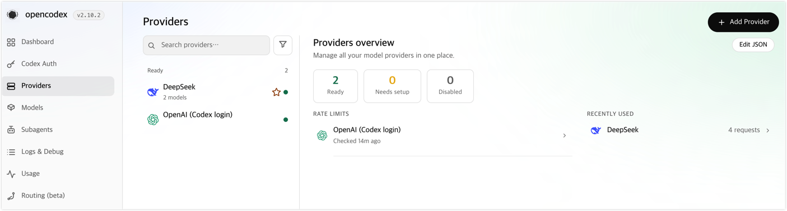
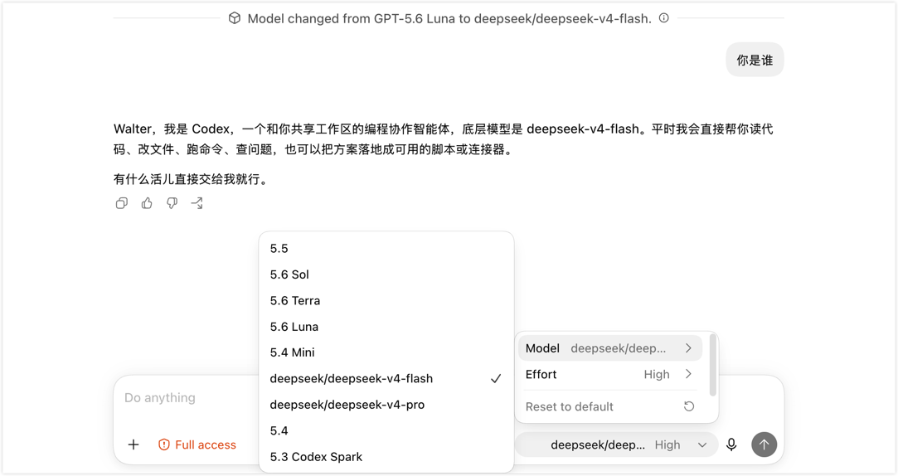

我在 Codex Desktop 里经常遇到一种情况，任务已经完成大半，只剩几处简单修改，此时更想临时换一个响应快、成本低的模型，把收尾工作做完。

目前火热的 DeepSeek V4 Flash 正式版，已经可以通过 Responses API 直接接入 Codex，但我之前切换 provider 时遇到聊天记录消失的问题，使用起来不够丝滑，后来我改用 [opencodex](https://github.com/lidge-jun/opencodex) 管理模型路由，才把“临时换模型”和“继续当前任务”这两件事放到了一起。这篇文章记录我的设置过程，以及几条容易误判的启动日志。

<!--truncate-->

## 为什么先试 DeepSeek V4 Flash

我最初注意到 DeepSeek V4 Flash，是因为 [Artificial Analysis](https://artificialanalysis.ai/models/deepseek-v4-flash) 的评测数据。下面这张图根据这份数据整理：横轴是完成 Intelligence Index 任务的成本，纵轴是综合分数。越靠左，单次评测成本越低；越靠上，分数越高。

从 2026 年 7 月 31 日的数据快照看，V4 Flash 0731（max）的位置很显眼：它的分数不在最顶端，完成同一套评测的成本却很低。这张图不能证明它一定适合我的代码任务，但足以让我把它放进低成本候选里试一轮。


<p className="article-banner-caption">基于 Artificial Analysis Intelligence Index v4.1 数据整理，数据采集于 2026-07-31。横轴的 Cost per Task 是评测成本，不是 API 的 token 单价。</p>

DeepSeek 官方资料显示，V4 Flash 支持 100 万 token 上下文，输出价格为每百万 token 2 元人民币。把这些信息放在一起，我的判断很简单：它值得放进 Codex 里试一试，但是否真的好用，还是要看实际代码任务。[模型说明](https://api-docs.deepseek.com/news/news260424/) 和 [模型价格](https://api-docs.deepseek.com/zh-cn/quick_start/pricing/) 都可能变化，使用前最好再看一眼官方页面。

## DeepSeek 已经能直连 Codex，为什么还要用 opencodex

DeepSeek V4 Flash 现在已经原生支持 Responses API。按照[官方 Codex 接入说明](https://api-docs.deepseek.com/quick_start/agent_integrations/codex)，添加模型目录和 provider 配置后，Codex CLI、Desktop 和 IDE 扩展都可以直接使用 DeepSeek，不再需要额外的协议转换。

如果准备长期固定使用 DeepSeek，这条路径最简单。我的情况更像是临时换挡：先用原来的模型分析，做到一半再切到 DeepSeek 处理后续修改。Codex 会按登录方式和 provider 显示会话，配置切换后，原来的聊天记录虽然还在，却不一定继续出现在当前列表里。

这就是我后来改用 opencodex 的原因。它在本机启动代理，统一处理 provider 路由和模型目录同步；默认的本机接入方式仍让 Codex 使用原生的 `openai` provider 标识，切换模型时不用反复替换几份配置。对我来说，它解决的重点不是“能不能调用 DeepSeek”，而是“换完模型后能不能接着做当前任务”。

opencodex 不是接入 DeepSeek 的必选项，而是更适合频繁切换模型的一层管理工具。它会修改本机 Codex 配置和模型目录，请求也会先经过本机代理；具体机制和恢复方式可以参考 [opencodex 的 Codex 集成说明](https://opencodex.me/guides/codex-integration/)。

这个思路刚好对上了我的需求：不改变使用 Codex 的方式，只在需要时换一下背后的模型。

## 快速完成 opencodex 设置

下面以我使用的 opencodex `2.10.2` 为例，项目当前要求 Node.js 18 或更高版本，可以先检查本机环境，再通过 npm 安装：

```bash
node -v
npm install -g @bitkyc08/opencodex
ocx --version
```

如果安装输出明确提示 Bun 的 postinstall 脚本被 npm 阻止，可以按报错建议重新安装。我在本机遇到该问题时使用的是：

```bash
npm install -g --allow-scripts=bun @bitkyc08/opencodex
```

这不是常规安装步骤，不同 npm 版本的处理方式可能不同，先看完整报错再决定是否执行。

### 初始化 DeepSeek 配置

安装完成后运行：

```bash
ocx init
```

在向导里搜索并选择 **DeepSeek**，然后填写 API Key、默认模型和代理端口：

- API Key 可以从 [DeepSeek 平台](https://platform.deepseek.com/api_keys) 创建。
- 本文使用的模型是 `deepseek-v4-flash`。
- 代理端口保持默认的 `10100` 即可。

provider 的排序和默认选项会随版本变化，不需要记住它排在列表第几个。运行 `ocx init` 前，我会先让 Codex 回到原生配置，避免其他 provider 管理工具同时修改 `config.toml`。

### 启动代理

配置完成后启动服务，再检查一次状态：

```bash
ocx start
ocx status
```

浏览器打开 `http://localhost:10100`，可以看到 DeepSeek 是否已经就绪、当前发现了哪些模型，以及最近的请求记录。



<p className="article-banner-caption">opencodex Providers 页面，截图版本为 2.10.2。</p>

这里顺手提醒一句：opencodex 是独立社区项目，请求会先经过本机代理，再发往所选 provider。管理页面和代理端口默认只在本机使用，不要直接暴露到公网；API Key、账号信息和请求日志也不要提交到代码仓库。部分 provider 对第三方代理另有要求，接入前最好确认对应的服务条款。

### 在 Codex Desktop 中切换模型

回到 Codex Desktop，打开模型选择器，就能看到带 provider 前缀的 `deepseek/deepseek-v4-flash`。



<p className="article-banner-caption">在同一个 Codex Desktop 会话中切换到 <code>deepseek/deepseek-v4-flash</code>。</p>

设置完成后，日常使用基本不需要再碰配置。

## 几条容易误判的启动日志

下面这些解释来自我使用 `2.10.2` 时的输出。后续版本的日志文字可能不同，遇到不一致时可以先看 `ocx status` 和 `ocx doctor`。

- **`Previous session (PID xxxx) did not shut down cleanly.`**：上次代理没有正常停止。先检查当前状态；如果服务运行正常，后续用 `Ctrl+C` 或 `ocx stop` 结束即可。
- **`Provider model discovery ... omitted configured model ids`**：在线发现到的模型目录与手工配置的旧模型 ID 不一致。它通常不是调用失败，先看 provider 当前返回的模型列表。
- **`Codex app-server process(es) still running`**：Codex 的后台进程还在使用旧模型目录。等手头任务结束后执行 `ocx sync --restart-codex`，让 Codex 重新加载目录。
- **`Incomplete coverage: ... account(s) excluded`**：这类信息通常来自账户池或套餐识别，不等于 DeepSeek 链路有问题，要结合当前 provider 和实际请求日志判断。

用上之后，我还特意试了怎么退回去。接入工具如果只能进不能退，用久了反而心里没底。

## 如何恢复原生 Codex

临时停止前台代理，在运行 `ocx start` 的终端按 `Ctrl+C` 即可。想停止代理并让 Codex 回到原生配置，使用：

```bash
ocx stop
```

如果只恢复 Codex 配置、暂时保留代理进程，可以使用：

```bash
ocx restore   # 别名：ocx eject
```

## 写在最后

如果只是想长期固定使用 DeepSeek，优先按照官方文档直接接入 Codex 会更简单，也少了一层本机代理。opencodex 对我真正有用的地方，是一个任务做到一半时可以临时换模型，做完后还能回到原来的工作方式，不需要重新开一个对话解释前因后果。

V4 Flash 的价格和评测结果只是我开始尝试的理由。最后让我留下这套方案的，是它减少了切换模型时的打断。现在我判断一个模型工具是否顺手，也会看它能不能让我少花时间重新找回上下文。
