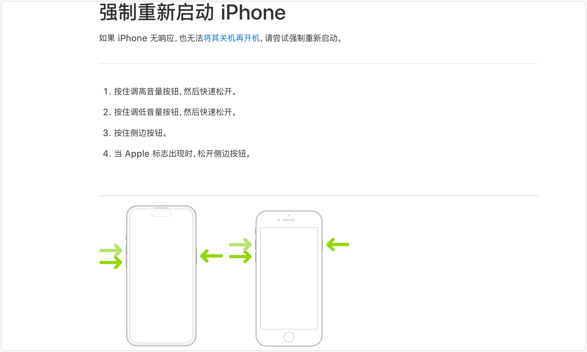
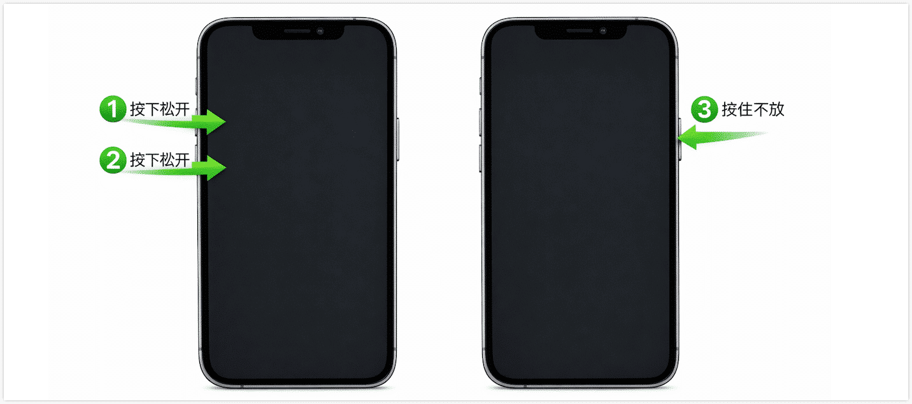
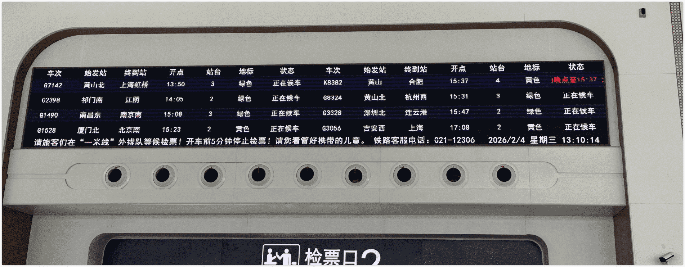
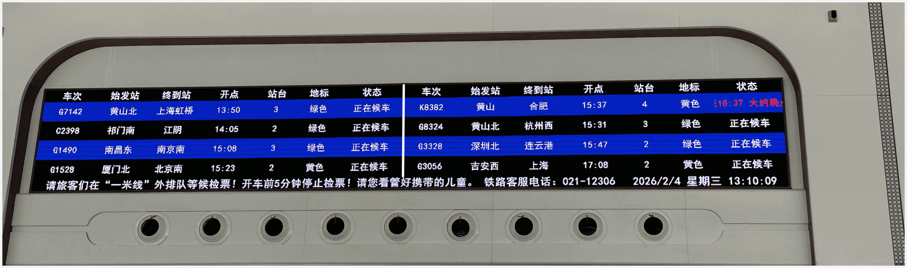
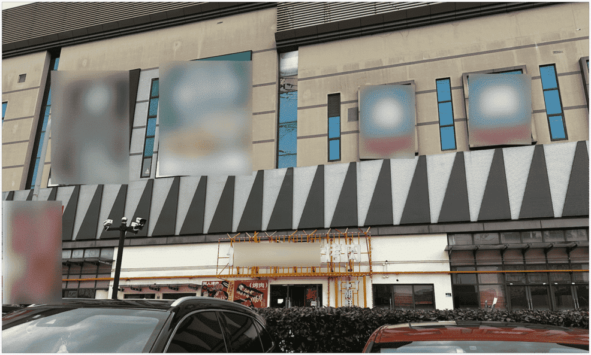
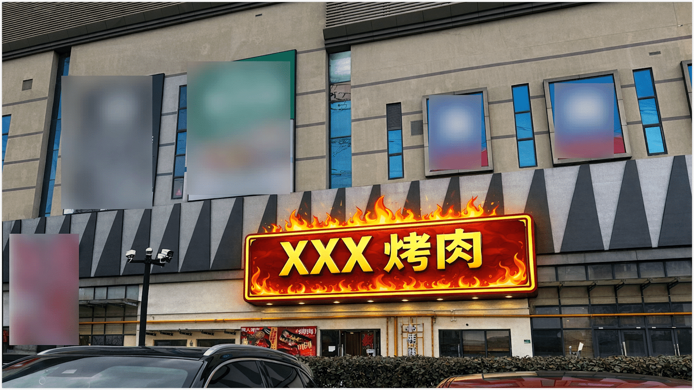

作为一名内容传播从业者，我的工作就是把复杂信息转化为清晰、可操作的内容。久而久之，我养成了“职业病”：走到哪儿都忍不住审视周围的信息呈现方式。这不，最近遇到几个典型案例，拿出来分享，换换口味，不讲严肃的原理，一起来看看我们是怎么被信息误导的，也提醒自己在内容设计时避免犯错。

<!--truncate-->

## 案例一：苹果大厂的颜色谜语
上周吃完午饭，有个朋友的 iPhone 死机，问我怎么强制重启，这我也不会呀，于是前往苹果官网搜索看看，找到了如何强制重启的介绍文档，看到那张经典操作图：两部手机并排，绿色箭头分别指向音量+、音量-和侧边电源键，箭头颜色略有渐变。

  图片来自 Apple 官网

盯着看了几秒，都没弄清顺序，最后还是得读文字才明白：先快速按音量+，再快速按音量-，然后长按电源键。单靠图片，三个绿色箭头很容易让人猜错执行顺序，我第一眼甚至以为是要一起按住的。

**背后原理**：视觉层级（Visual Hierarchy）

视觉层级通过大小、颜色、位置、编号等手段引导用户按重要性或顺序感知信息。此外，人们天生更倾向先看图片，文字主要充当辅助解释以及用于无障碍信息呈现的保障手段。如果仅靠微妙颜色渐变建立顺序，认知负荷高，容易迷失（参考 Visme《12 Visual Hierarchy Principles》）。

**改进建议**：
在箭头上直接标 1、2、3，或用带编号的步骤图，清晰的视觉引导远比单纯美观更重要。
我们偷个懒，直接将上述意见输入给 AI，生成了一个新的设计图，效果类似如下：

  图片来自 AI 加工

## 案例二：虚惊一场的列车晚点
年初我在高铁站候车时，电子显示屏上的时刻表把我吓一跳：我乘坐的 G1742 次列车，也就是下面表格里的第一行，预计是 13:50 到站，视线习惯性的往后一扫，看到了红色字体的晚点信息（晚点至15:37）。

  图片来自 Walter 拍的高铁显示屏

吓得我赶紧仔细核对，这才发现后面的晚点信息是另一辆列车的。好嘛，也就是说，一行信息里展示的是两列车的记录。

我离得检票口比较近，听到至少五六个人跑去问工作人员“我这趟车（G7142）晚点了吗？”，工作人员都快给整麻了。

要知道高铁站是一个环境嘈杂、旅客匆忙、视线容易受限的场所，所以信息设计通常需要直观，抗干扰能力强。

**背后原理**：F 型阅读模式 + 格式塔接近原则

- F 型阅读模式（Nielsen Norman Group 眼动追踪研究）：用户扫描列表或表格时，通常先横向快速扫几行，再沿左侧垂直扫，不会逐字细读。密集信息中，横向扫描容易把一行内容“连读”（详见：https://www.nngroup.com/articles/f-shaped-pattern-reading-web-content-discovered/）。
  

  图片来自 Nielsen Norman Group 眼动追踪研究

- 格式塔接近原则（Gestalt Principles）：视觉上靠近的元素会被大脑自动归为一组。没有分隔线，不同列信息就被错误分组。

**改进建议**：
直接加一条细竖线隔开两个列车的信息，或用背景色/间隔区分列。公共信息屏误读成本极高，一条线就能省无数麻烦，现场的工作人员也表示十分认可，省的老是被人追问是不是晚点了，哈哈，模拟效果如下图：

  调整后的高铁时刻表

:::tip

当然啦，还可以有更精细的设计，比如行间留白、地标的颜色和文字内容一致、表格增加细线边框之类的，但是目前加个竖线是最简单、最快速的方式了。

:::

## 案例三：美美隐身的烤肉招牌

周末路过一家商场超市买食材的时候，看到外墙上挂着"xxx烤肉"的招牌，有点奇怪，白色文字配浅白色背景墙，支撑招牌的黄色金属架又和大楼的黄色公共管道颜色高度重合。而且门口有绿化带的遮挡，白天从远处看，根本读不出字，或者说压根不知道这里还有个饭店，只剩一堆管道后面隐约飘着几个字。
我稍微站远拍了个照，你能一眼看到它在哪里吗？

  图片来自 Walter 拍的商场超市

虽然它几乎占据在画面的中央，却不易发觉，当然了，我看这个招牌上有很多灯珠，可能它在晚上把灯开启后会非常好看和显眼，但白天的客流也是非常重要滴哦。

**背后原理**：对比度原则（Contrast）
对比度是视觉设计最基础也最关键的原则，确保信息在各种环境下都能被快速识别。低对比度严重影响可读性，尤其在受自然光影响的户外场景（WCAG 2.2 要求文本与背景对比度至少 4.5:1）。白色字配白色墙，黄色支架高度重合公共管道，直接让信息“消失”。

**改进建议**：
换高对比度配色，比如餐饮业中，火锅烤肉之类的常用红黄色来刺激食欲。商业招牌的第一要务是“被看见”，而不是只在特定场景或光线下好看。
对于招牌设计，我这个外行是一点都不会，有请 AI 搭子画一个，效果如图，虽然审美有点土味，但至少比之前显眼多了：

  图片来自 AI 加工

## 小结：小设计，大影响

这三个案例，既有科技巨头，也有公共交通设施和商业招牌，看似无关，却都踩中同一个坑：信息设计的细节非常重要，需要尊重实际场景和用户的认知习惯。
一个小序号、一条分隔线、一次对比度颜色调整，就能避免大量误解。作为信息传播从业者，这些案例也在时刻提醒我们清晰沟通的价值：它不仅是专业技能，更是对用户时间和情绪的尊重。
你遇到过哪些信息设计“小坑”？或者觉得哪个原理最常被忽略？欢迎留言讨论，一起让世界的信息更友好一点！😄