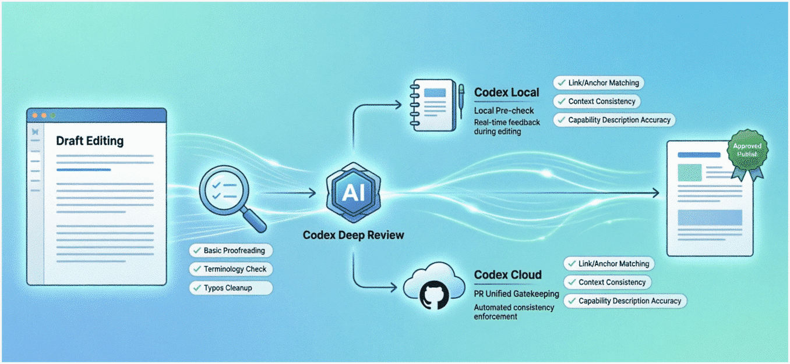
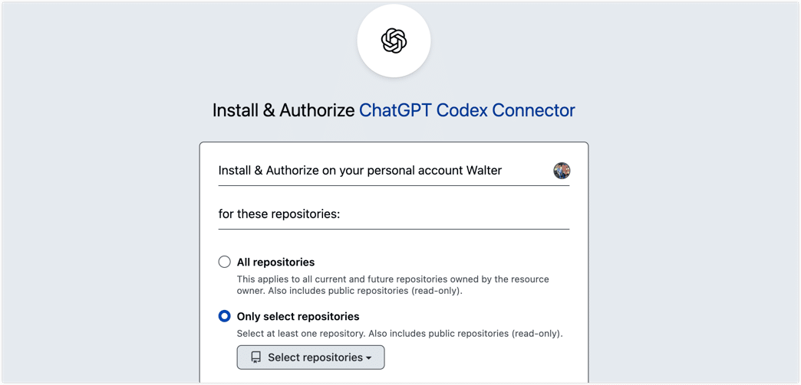
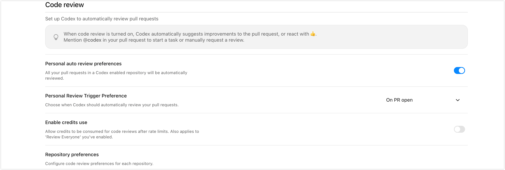
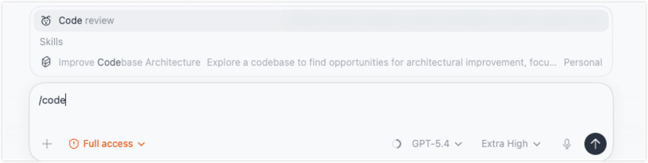
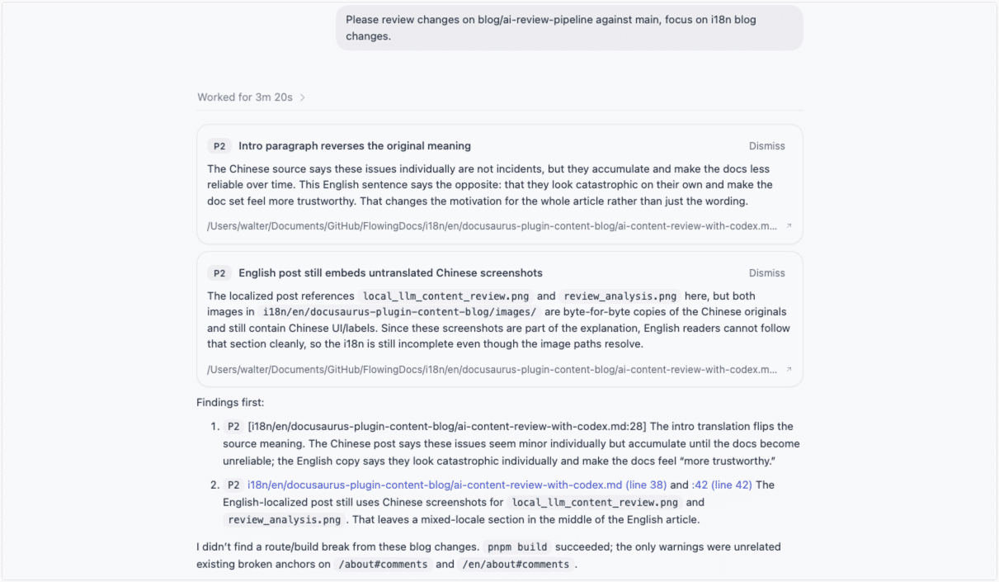

Once your docs fully live in GitHub and follow a Docs-as-Code workflow, review starts to look a lot more like software collaboration. That is mostly a good thing: we get history, branches, pull requests, and a cleaner workflow. But it also means the quality bar rises fast.

Over the past few months, I ended up building a layered review workflow for technical content. I started with a lightweight local validation step for typos and surface-level issues, then added Codex for deeper local and cloud review, and finally used `AGENTS.md` to turn a lot of tacit review judgment into reusable rules.

This post is not just a tool recap. It is really about why this workflow is worth building, where each layer helps, and where AI review still needs a human in the loop.

<!--truncate-->

## Why I Started Using AI for Content Review

When docs are managed like code, they naturally plug into the engineering workflow. That part is great. The harder part shows up later, when the doc set gets bigger and review becomes repetitive.

The first things human reviewers tend to miss are usually not the big, dramatic mistakes. They are the small issues that keep showing up over and over:

- typos and awkward sentences
- broken internal links, anchors, images, or navigation references
- the same term written three different ways
- product capability descriptions that slowly drift away from reality

None of these looks catastrophic on its own. But over time they add up and make a doc set feel less trustworthy. And they rarely appear in one neat place. They are scattered across pages, versions, and pull requests.

That is what pushed me toward stronger AI review. Not because I wanted AI to replace people, but because it sits in a very useful middle ground: it understands more context than rules and spell-check tools do, and it is more consistent than asking a human to manually scan every page every time.

## Before Codex: A Lightweight Local Review Layer

Before I brought Codex into the workflow, I had already built a lighter local validation layer around smaller open models plus domain-specific training data.

The goal was deliberately narrow. I was not trying to make a model understand everything. I wanted it to catch the boring, high-frequency issues that scale badly with manual review: typos, terminology mistakes, obvious sentence problems, and a few formatting anomalies.


The upside was obvious: it was fast, cheap, controllable, and good at scanning the whole repository. In one run it checked roughly 380,000 characters in a little over an hour, which worked out to around 100 characters per second.


For a living doc set, that kind of coverage is extremely cost-effective. But the limits are just as clear. Small models and lightweight rules are much better at surface quality than factual correctness. They can tell me a sentence has a typo. They cannot reliably tell me whether the sentence is technically misleading. They can spot inconsistent terminology. They are much less reliable at noticing that a feature description no longer matches the actual product.

That was the real reason I started taking stronger AI review seriously. Not because it felt more "intelligent," but because it was better suited to the messy, repetitive, scattered problems that humans are least consistent at catching.

:::tip

This post is not really about the local validation platform itself. If you are curious about how I built that layer, I can write a separate post on it later.

:::

## Bringing Codex Into the Review Flow

### What Codex Adds for Docs Review

By the time I introduced Codex, I already had a lightweight local pass for typos, terminology slips, and basic expression issues. But once I wanted to go after harder problems, that layer stopped being enough.

Some review tasks are inherently more contextual:

- Does this link still resolve?
- Does the anchor still exist after the heading changed?
- Does the sidebar entry still match the file path?
- Does this page describe the product the same way other pages do?
- Is this sentence technically correct, or just grammatically polished?

That is where Codex started to make sense.

At a high level, I think of Codex as AI agent capability built for developer workflows. For this use case, the key split is simple:

- **Codex Local**: runs locally through tools like the CLI, IDE integrations, or the desktop app
- **Codex Cloud**: runs in the cloud and plugs into GitHub review

For docs, those two modes naturally map to two different stages. Local review is great while the author is still editing and can fix issues early. Cloud review works well as a consistent backstop in the pull request stage. That way the process does not depend on every contributor having the same local setup or remembering to run review before they commit.



So the final flow became layered. The first layer is still the lightweight local checker that cheaply clears out basic problems. The second layer is a stronger Codex review that looks at the issues the lightweight layer is not good at: links, anchors, sidebar alignment, conflicting product statements, and wording that may technically mislead the reader.

### How I Set Up Codex Cloud

The cloud setup itself is pretty straightforward. First, go to the [Codex connector settings page](https://chatgpt.com/codex/cloud/settings/connectors), connect GitHub, and authorize the repository you want Codex to review.



After that, head to the [Code Review settings page](https://chatgpt.com/codex/cloud/settings/code-review) and decide how you want reviews to run: whether they should trigger automatically on pull requests, whether they should apply to all contributors, and so on.



Once that is done, the cloud side is basically ready.

### Why `AGENTS.md` Matters So Much

Connecting a repo to Codex is not the same thing as making it good at reviewing docs.

Without repo-specific instructions, Codex behaves more like a general-purpose code reviewer. That is useful up to a point, but documentation repositories have different failure modes. In practice, that usually creates two kinds of noise:

- it misses issues that actually matter in docs
- it reports issues that are not worth treating as findings

That is why `AGENTS.md` matters.

I think of `AGENTS.md` as a repo-level instruction file for review. It is not meant to be a giant writing guide. Its job is to tell Codex what is important in this repo: which problems deserve extra attention, which ones can be ignored, which directories need stricter checks, and where the reviewer should stay conservative.

OpenAI's own guidance points in the same direction: put stable, reusable rules in `AGENTS.md`, and keep them concise and maintainable.

:::tip

In practice, you do not have to stop at one `AGENTS.md`. Codex reads instructions by directory and gives more weight to the file closest to the changed content. If your repo is simple, one file under `docs/` may be enough. If you also have versioned content, reused snippets, or special subtrees, layered instruction files usually work better.

:::

Once I started thinking about it this way, `AGENTS.md` felt less like documentation and more like a review contract. It tells the reviewer how to review.

For example, a `docs/AGENTS.md` can stay quite small and still be very effective:

```markdown
## Review Focus

- Treat current product behavior, defaults, limits, and UI labels as the source of truth for the current version. If something is uncertain, say it is unverified instead of guessing.
- Verify that procedures are complete and sequenced correctly. If a step involves permissions, cost, network access, destructive actions, or data risk, the warning should be explicit.
- Check that internal links, heading anchors, relative paths, image references, document `id` values (usually the filename), and sidebar references all stay aligned.
- Content under `docs/reuse-content/**` may be reused across multiple pages. Review changes there with downstream impact in mind.
- Under `docs/images/**`, make sure image paths, casing, and extensions match the actual referenced files.
```

If you also maintain historical content such as `versioned_docs/`, it is worth adding a more conservative instruction file there too. Old docs are not supposed to sound newer. The biggest risk is silently rewriting old-version behavior into current-version behavior.

At the time I wrote this post, Codex review on GitHub was also biased toward higher-severity issues. So if you want it to take documentation typos, terminology drift, or localization gaps seriously, those expectations need to be made explicit in `AGENTS.md`.

:::tip
Of course, a complete `AGENTS.md` includes much more, such as review scope, a repository structure overview, and conventions for review output. For a related example, you can refer to the root directory of [this repository](https://github.com/heywalter/FlowingDocs) and `i18n/en/AGENTS.md`.
:::

## How I Use It Locally and in Pull Requests

Once the review flow and rules are in place, I use it in two moments.

**While editing locally**

I run a local pass first through the Codex desktop app or CLI so I can catch issues before the pull request stage. In the desktop app, for example, I can trigger `/code review` and choose the scope I want to inspect.




An example of the review output is shown below. You can see that the review goes quite deep: it can even catch inconsistencies between the Chinese and English content, as well as Chinese images appearing in the English article.





:::tip

The nice thing about local review is flexibility. For quick passes, I can use a faster model. For a heavier change set, I can switch to a stronger model and ask for a deeper look.

:::

**After the PR is opened**

Once a pull request is up, Codex Cloud can review it automatically. If automatic review is not enabled, I can still trigger it manually in the PR with `@codex review`. I like Cloud review as a safety net because it does not assume everyone on the team has the same local setup or workflow habits.

One caveat is that cloud review does not magically expand scope on its own. At the time I wrote this, Codex Cloud used **GPT-5.3-Codex** and focused by default on **P0** and **P1** issues. If I want it to treat doc typos, terminology drift, or similar content problems as worth flagging, I need to encode that expectation in `AGENTS.md`.

In practice, I get the best results by combining both layers. Local review works as the pre-flight check before commit. Cloud review acts as the consistent backstop at PR time.

And interestingly, the biggest value is not finding one dramatic bug. It is catching the same class of easy-to-miss issues again and again with much better consistency:

- a heading changed, but an in-page link still points to the old anchor
- a sidebar entry still references the old path
- one page got updated with the new product behavior, while another page still describes the old one
- historical content was accidentally rewritten in current-version language

That is the part I value most. Codex does not replace human judgment. It turns doc review from "someone experienced scans it and hopes nothing slips through" into something layered, configurable, reusable, and much easier to improve over time.

## Final Thoughts

Looking back, the most important change was not "I added an AI tool." It was that doc review started to feel like a system.

Basic issues get filtered cheaply at the local layer. Harder issues get pushed to a stronger review pass. Repeated review judgment gets written down in `AGENTS.md` so the process becomes easier to reuse instead of living only in one person's head.

It is still not perfect. The lightweight layer is better at surface quality. Codex is better at context and consistency. And the final business judgment still belongs to a human.

That is exactly why I find this approach useful. The best version of AI review is not one that replaces people. It is one that takes repetitive, brittle checking off their plate so they can spend more time on the questions that actually need judgment.

If you are experimenting with AI-assisted content review too, I would love to hear how you are approaching it. Do you prefer to filter with a lightweight local layer first, or would you rather plug a stronger AI reviewer directly into the PR flow?
