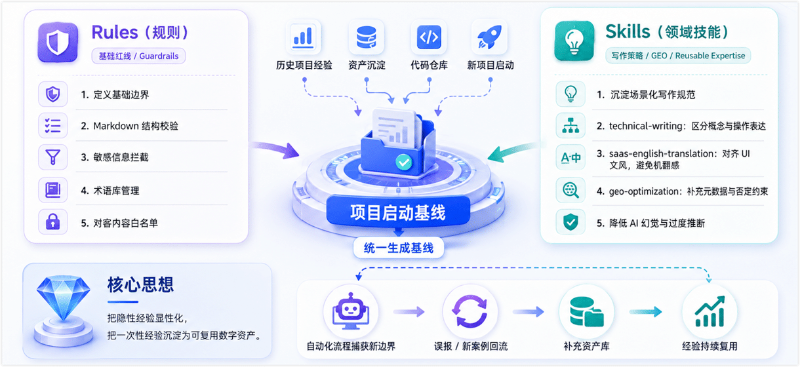
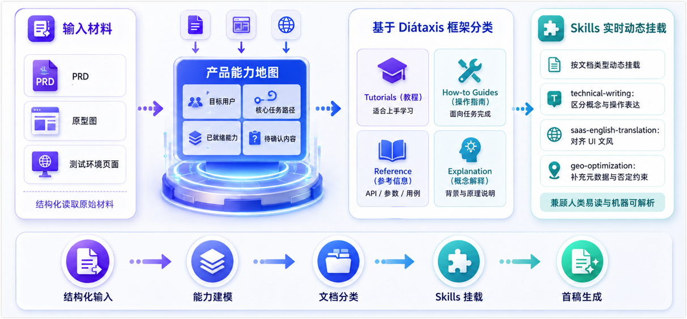
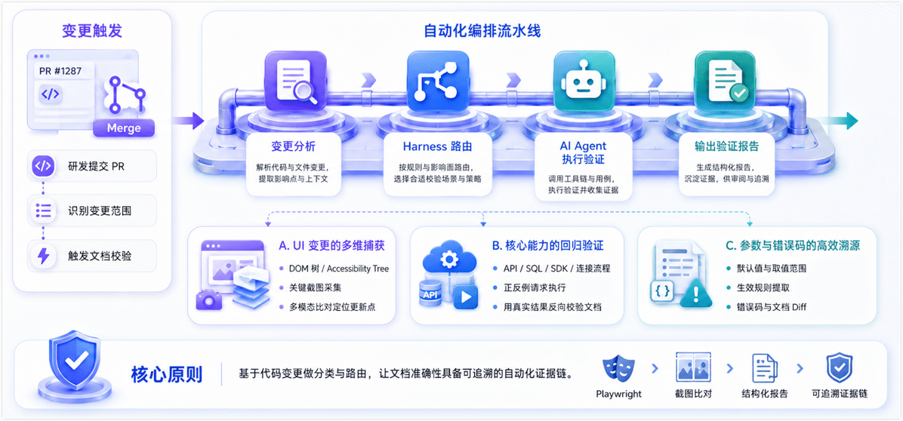

Summary: Large AI models can quickly generate product documentation that looks complete. But whether that content matches real user paths, has been verified, and is safe to publish for external users is still a high-certainty problem. This post records a real documentation engineering practice: how we moved from one-off AI chat generation plus manual patching to a verifiable and reusable documentation production flow built around Rules, Skills, validation Harnesses, and human review. Through this workflow, the documentation team improved the customer-facing quality of complex software docs and moved its focus further upstream, from content writing to documentation platform engineering, knowledge architecture design, and developer experience.

<!--truncate-->

Early in this project, the team faced a tight delivery schedule and a large amount of scattered source material. To align product and engineering teams quickly, we first tried feeding PRDs, prototypes, and implementation logic into a large language model to generate a batch of drafts. For internal review and discussion, that one-off experiment worked reasonably well.

But when the product was ready for general availability (GA) and external customers, those drafts landed with the documentation team for final publication. That was when deeper problems surfaced. The original single-document prompting model was fragmented by nature. The model tended to inherit the perspective of code and PRDs, failed to naturally construct a user's learning path, lacked progressive disclosure at the global level, and did not verify procedures or API calls through real execution. In other words, the drafts could create real risk for users.

At first, we tried the usual fixes: writing longer prompts, or assigning people to manually review every article. But with a large number of configuration parameters and complex business logic, pure prompt engineering and manual checking quickly hit their limits. AI would still occasionally invent configuration items, weaken important constraints, or package internal implementation details as customer-facing capabilities.

That forced us to rethink the problem. The issue was not that AI could not write good documentation. The issue was that we were trying to solve a high-certainty engineering problem with a loose black box. If AI tends to fail at the boundaries, we need to design the boundaries and evidence mechanism first. If previous projects have already taught us painful lessons, we should not teach them to the model from scratch every time.

So we paused large-scale content generation and took a step back. Before asking AI to write more, we made the team's accumulated tacit experience explicit and used it as the foundation for every generation task that followed.

## Step 1: Turn past experience into a generation baseline

The first step in building the workflow was not asking AI to write new docs. It was building a constraint framework.

We did not invent rules for the new project from nothing. Instead, we turned lessons from several past projects into two core assets in the code repository and used them as the starting baseline for the new project:

- **Rules**: Define the basic boundaries, including Markdown structure validation, sensitive information blocking, terminology lists, and allowlists for customer-facing content.
- **Skills**: Capture writing conventions and GEO (generative engine optimization) strategies for specific scenarios so the content works better for both readers and AI crawlers. For example, `technical-writing` distinguishes between concept and task writing; `saas-english-translation` controls the English translation voice, avoids machine-translation artifacts, and aligns with UI wording; and `geo-optimization` adds page metadata and explicit negative constraints to reduce over-inference by AI systems.

These Rules and Skills continue to evolve as the project progresses. For example, when the automated workflow catches a new boundary case or false positive, we feed it back into the asset library so the team's experience becomes reusable digital infrastructure.

## Step 2: Move from one-off prompting to controlled structured generation

With the rule baseline in place, we moved away from throwing a pile of materials at AI and letting it improvise. Instead, we adopted a controlled structured generation workflow.

1. **Build a product capability map**
   Before generating any specific document, we ask AI to read the PRD, prototype, and test environment pages, then produce a structured capability map for the product. This becomes the master outline for later content generation, covering details such as the target user, core task path, ready capabilities, and content that still needs confirmation.
2. **Classify content with the Diátaxis framework**
   Based on the capability map, we use the [Diátaxis framework](https://diataxis.fr/) (tutorials, how-to guides, reference, and explanation) to split work into concepts, tutorials, how-to guides, and reference information. Concept docs focus on business context. Task docs attach real screenshots and expected results. Reference docs align with API behavior, parameters, and use cases that later pass Harness validation.
3. **Attach Skills dynamically**
   For each generation task, we explicitly attach the Skills that match the document type. This lets the first draft move closer to being both human-readable and machine-parsable from the start.

## Step 3: Use automation to make documentation iteration deterministic

Content generation is only the starting point. Keeping docs accurate during continuous iteration is the real engineering challenge.

To make that possible, we brought code changes into the documentation trigger mechanism. When engineering opens a PR, the system can analyze the change scope and route it to the relevant validation Harness, borrowing the idea of a test harness from software engineering. An AI Agent then executes the validation tasks automatically and outputs a report. For a complex software product, this mechanism can cover scenarios such as:

- **Multidimensional capture for UI changes**
  Product interfaces change frequently, and manual comparison is easy to miss. To handle this, we built a baseline that maps UI surfaces to documentation. When page structure, routes, or key UI text changes in code, validation runs automatically. With Playwright, the agent logs in to the product, collects the DOM tree, accessibility tree, and key screenshots, then compares them with historical docs using multimodal analysis to identify the paths and descriptions that need updates.
- **Regression validation for core capabilities**
  When the system detects changes to API signatures, parameters, or underlying logic, the AI Agent calls a test instance and runs predefined positive and negative requests. Real execution results are then used to validate whether the current documentation still describes the API, parameter boundaries, and error handling correctly. The same approach can also validate database SQL, SDK sample code, or connection configuration flows.
- **Efficient tracing for parameters and error codes**
  When configuration annotations or exception-throwing logic changes, the system extracts the latest defaults, value ranges, effective rules, and error codes from source code or spec files, then diffs them against the documentation. This greatly reduces lag and errors caused by manual copying.

The specific validation logic still needs to be tailored to each product. But the core principle stays the same: classify and route based on code changes so documentation accuracy checks can move from manual spot checks to an automated evidence chain based on real execution.

## Where documentation engineers create value after the workflow is systematized

Once Rules, Skills, Harnesses, and execution boundaries are in place, the system can handle basic generation and validation. That does not weaken the role of documentation engineers. It moves the role earlier in the process and makes it more engineering-oriented.

In the past, good ideas for automated validation were often blocked by coding ability. Today, AI-assisted programming lowers that barrier and lets us turn tacit experience directly into runnable tools. Our work is shifting from content delivery toward three higher-value areas:

- **Building reusable documentation quality infrastructure**
  Turn understanding of documentation scenarios into automated guardrails. Encode lessons learned into validation Harnesses in CI/CD pipelines so content quality no longer depends entirely on manual checks before release.
- **Designing knowledge architecture for both humans and machines (GEO practice)**
  In the AI era, documentation also becomes corpus material for RAG systems and AI assistants. We need strict heading hierarchy, consistent terminology, upfront limitations, and standard Problem-Cause-Solution structures to reduce hallucinations in AI answers and support generative engine optimization (GEO).
- **Controlling customer-facing boundaries and feeding back into developer experience (DX)**
  AI is good at piling up information, but it cannot replace business sensitivity. We still need to decide which internal details should stay hidden and which complex APIs might mislead users. At the same time, vague error codes or unfriendly workflows discovered while building Harnesses can be fed directly back to engineering, moving the documentation feedback loop earlier and making it part of improving developer experience.

In short, AI has not pushed us to the end of the workflow. It has given us a way to reshape documentation work with engineering thinking and become designers of content rules and knowledge architecture.

## Unfinished work and next steps

Engineering is never finished. Although we have built a basic validation loop, several important directions are still in progress:

- **From finding errors to recommending rules**: Troubleshooting still requires humans to update rules. Next, we want agents to use failure reports to infer and generate update suggestions for Rules and Skills, leaving humans to review and merge.
- **From point validation to flow validation**: Current Harnesses focus mostly on single APIs, UI surfaces, SQL references, and similar units. Next, we want to simulate end-to-end business flows in a sandbox, such as creating a resource, triggering a task, and asserting its status, so complex tutorials can be validated end to end.
- **From local analysis to sandbox attribution**: For high-risk operations, such as deleting resources or changing global settings, and for complex SDK compilation errors, we want to reproduce issues in an isolated cloud sandbox. The agent can collect logs and summarize fixes there, balancing safety and efficiency.
- **From build-side validation to consumption-side feedback**: We are exploring how to bring search terms, frequent error codes, and similar telemetry into the customer-facing site. With proper anonymization and compliance controls, real user blockers can become documentation improvement issues automatically.

No matter how the system evolves, the boundaries must stay clear. The model is responsible only for difference analysis and suggestions. Sensitive credentials must never enter the repository. The final decision on whether content should change always stays with the documentation engineer.

## Conclusion

Looking back on this practice, Docs as Code became much more tangible for us.

Bringing AI into documentation engineering is not just about switching to a smarter writing tool. It is about giving knowledge production real engineering certainty. Models do compress the time it takes to write a draft. But their deeper value is that they force us to re-examine the business itself: Which tacit lessons can be structured? Which factual claims can be verified automatically?

When tedious text movement and formatting checks are handled by the system, documentation engineers can finally focus their energy on the parts that truly require human judgment: understanding user intent, designing information architecture, defining validation standards, and controlling customer-facing boundaries.

AI is evolving from a text generator into an executable agent. But that leap depends on CI pipelines, guardrails, sandboxes, and human review working together. In this process, we turn experience into rules, guesses into evidence, and use the certainty of systems to counterbalance the randomness of large models.

Ultimately, we are no longer just writing documentation. We are using engineering methods to let documentation be built, tested, reviewed, and continuously improved like modern software.

## Further reading

- [How I Review Technical Docs with AI: From Lightweight Local Checks to Codex Code Review](./ai-content-review-with-codex.md): A layered AI review workflow for technical docs using local checks, Codex Local, Codex Cloud, and AGENTS.md to catch issues humans often miss.
- [Building a Local AI Content Review System: From a Small Model to a Web Tool Your Team Will Actually Use](./building-a-local-ai-content-review-system.md): How I built a local AI proofreading system for technical docs, from rule design and model choice to structure protection, web UI, and feedback loops.
- [Diátaxis](https://diataxis.fr/): The classic information architecture framework that distinguishes tutorials, how-to guides, reference, and explanation based on user needs.
- [Google developer documentation style guide](https://developers.google.com/style/): Guidance for tone, terminology, formatting, and user-first priorities in developer documentation.
- [Docusaurus documentation](https://docusaurus.io/docs): Documentation for building Markdown and MDX documentation sites, including versioning and internationalization.
- [Vale documentation](https://vale.sh/docs): An open source approach to engineering terminology, style, and prose linting rules.
- [OpenHands (formerly OpenDevin)](https://github.com/All-Hands-AI/OpenHands): An open source project for understanding how AI agents execute complex software engineering tasks in isolated sandboxes.
