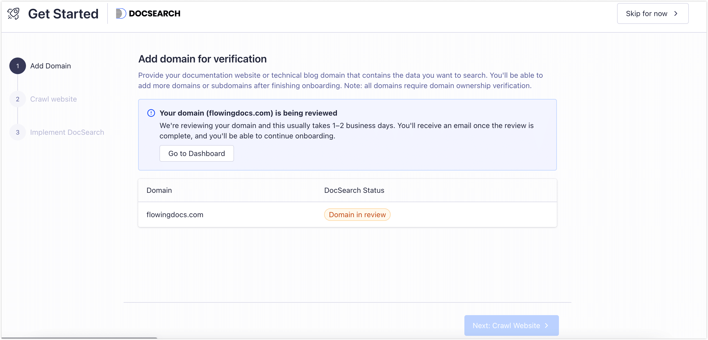
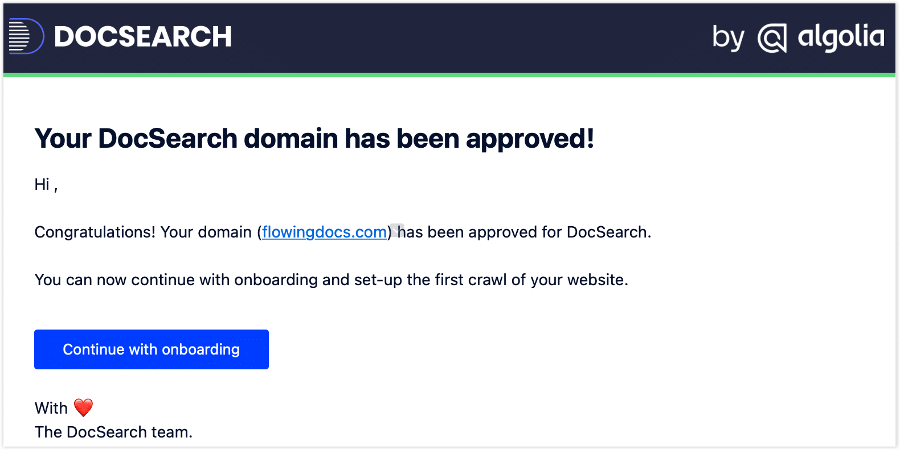
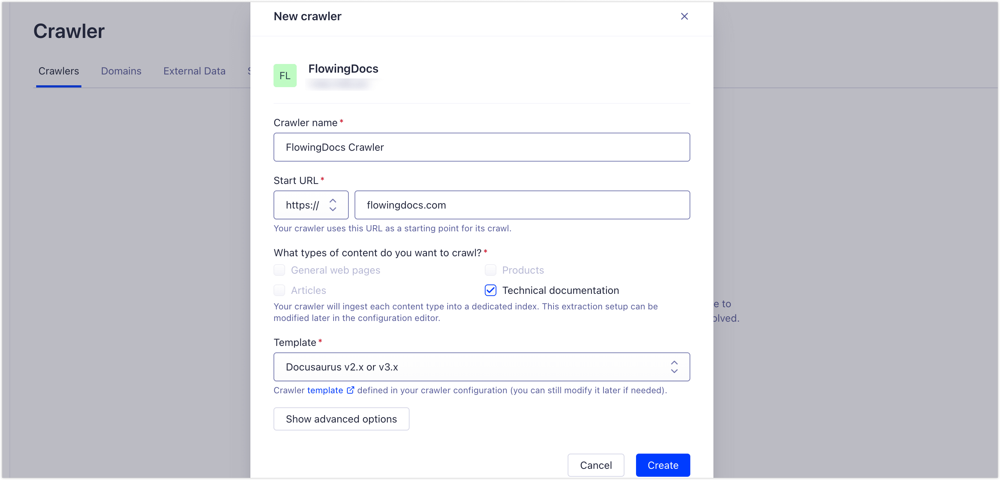
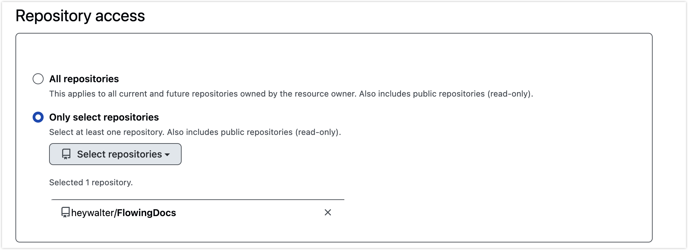

I spent longer than I'd like to admit evaluating static site generators. Hexo, Hugo, Astro, VitePress — I poked at all of them. Docusaurus is what I landed on, and after running it for a while, I don't regret it. It hit the specific combination I needed: write occasionally, keep docs and blog posts under one roof, and not spend a weekend wrestling with CSS just to get a decent theme.

This post is a walkthrough of that entire setup process—every integration, every config file, and a few things that tripped me up along the way. The complete source is on GitHub at [heywalter/FlowingDocs](https://github.com/heywalter/FlowingDocs). Feel free to fork it, just make sure to swap out the credentials (more on that below).

<!-- truncate -->

## Why Docusaurus

After trying the alternatives, a few things pushed me toward it:

- **MDX support out of the box.** You can drop React components directly into posts — no extra configuration needed. Useful when you want something interactive instead of just a wall of text.
- **A theme that's actually finished.** Dark mode, responsive layout, a sidebar TOC — all working without touching a single CSS file. The defaults are genuinely good.
- **A plugin ecosystem that covers the basics.** Search, comments, PWA, image zoom — available as maintained plugins. Install what you need, skip what you don't.
- **Maintained by people who depend on it.** Meta uses Docusaurus for the React docs, which means it's not going anywhere and bugs tend to get fixed. The GitHub activity reflects that.
- **Career transferability.** Docusaurus is the standard choice for many developer portals and internal documentation teams. The patterns you learn here — content structure, config management, deployment pipelines — transfer directly to production doc systems.

If you work with technical content professionally and want your blog and docs to live in the same place, this is a solid pick.

## Getting Started

You'll need Node.js v20.0 or higher. The official scaffold gets you running in one command:

```bash
npx create-docusaurus@latest my-blog classic
cd my-blog
npm start
```

Open `http://localhost:3000` and you should see the default site. That's your starting point.

:::tip Starting from my repo instead
Fork or clone [my repository](https://github.com/heywalter/FlowingDocs) and run `npm install`. Before anything else, replace these values — otherwise your comments and analytics will point at my accounts:

- Site info in `docusaurus.config.ts`: `title`, `url`, `organizationName`, `projectName`, `favicon`, navbar and footer links
- Algolia: `appId`, `apiKey`, `indexName`
- Google Analytics: `trackingID`
- Giscus: `repo`, `repoId`, `categoryId`
- Netlify: your repo and custom domain
:::

## Site Configuration

Everything lives in `docusaurus.config.ts`. The fields at the top are your site's identity:

```typescript
const config = {
  title: 'Flowing Docs',                    // Shown in browser tab and navbar
  tagline: 'Notes on tech and thinking',    // Subtitle on the homepage
  url: 'https://flowingdocs.com',           // Your deployed domain
  baseUrl: '/',                             // Keep as '/' for root deployment
  favicon: 'img/favicon.ico',              // 32x32 ICO recommended
  // ...
};
```

Get `url` and `baseUrl` right from the start — wrong values here mean broken links everywhere. That was the first thing I got wrong.

## Navbar and Footer

The navbar takes a logo and navigation items. You can pin items to either side:

```typescript
navbar: {
  logo: {
    alt: 'Flowing Docs Logo',
    src: 'img/logo.webp',
  },
  items: [
    { to: '/blog', label: 'Blog', position: 'left' },
    { to: '/docs/intro', label: 'Docs', position: 'left' },
    { to: '/about', label: 'About', position: 'right' },
  ],
},
```

I split the footer into two columns — resources on the left, social links on the right:

```typescript
footer: {
  style: 'dark',
  links: [
    {
      title: 'Learning Resources',
      items: [
        { label: 'Docusaurus Docs', href: 'https://docusaurus.io' },
        { label: 'React Docs', href: 'https://react.dev' },
      ],
    },
    {
      title: 'Elsewhere',
      items: [
        { label: 'GitHub', href: 'https://github.com/heywalter' },
        { label: 'Twitter/X', href: 'https://twitter.com/heywalter' },
      ],
    },
  ],
  copyright: `Copyright © ${new Date().getFullYear()} Walter. Built with Docusaurus.`,
},
```

SEO metadata and social sharing images also live in this config file. Global styles go in `src/css/custom.css` using CSS variables — Docusaurus handles light and dark mode switching automatically.

With the shell in place, the next step is wiring up search, analytics, and comments. Once your post count grows past a handful, these stop being optional.

## Algolia DocSearch: Site Search

Without search, a site with more than ~20 posts becomes genuinely hard to navigate. Algolia's DocSearch is the official recommendation for Docusaurus — free, fast, with fuzzy matching and result highlighting.

:::tip No credentials yet?
Use the `docusaurus-search-local` plugin in the meantime. It's a perfectly usable local search that takes about five minutes to set up. Swap it out for Algolia once you're approved.
:::

Two free tiers to know about:

- **Standard Build plan**: Available immediately on signup. ~10K searches/month, 1M records, 10K crawls/month. Fine for a small blog, but the headroom is limited.
- **DocSearch program** (recommended): Apply separately. ~50M searches/month, 5M records, 5M crawls/month, plus a dedicated crawler. Specifically designed for open-source and technical docs. [Eligibility details here](https://docsearch.algolia.com/docs/who-can-apply).

After applying, expect a response within 1–3 business days. The application screen looks like this:



Approval comes via email with next-step instructions:



In the Algolia Dashboard, go to **Data Sources → Crawler** and complete domain ownership verification:


Once verified, set up the Crawler. Algolia runs crawling on their end — nothing for you to host. They have a Docusaurus template that handles configuration correctly. Click **Setup Crawler**, name it, enter your domain, set type to **Technical documentation**, template to **Docusaurus v2.x or 3.x**, and hit **Create**:



The first build may not complete — your site doesn't have the Algolia credentials yet. That's expected. Go to **Indices** in the left sidebar and note your index name, then grab your `appId` and `Search API Key` from **Settings → API Keys**:


Drop all three into your config:

```typescript
algolia: {
  appId: 'YOUR_APP_ID',
  apiKey: 'YOUR_SEARCH_ONLY_KEY',
  indexName: 'YOUR_INDEX_NAME',
},
```

Deploy, then manually trigger a re-crawl from the Crawler dashboard. A few minutes later, your search box should return results.

:::tip Self-hosted option
If you have your own server, you can run the Algolia Crawler yourself on a schedule. More control, more maintenance. [Official docs here](https://docsearch.algolia.com/docs/legacy/run-your-own).
:::

## Google Analytics: Traffic Data

Once posts are live, you'll want to know if anyone's actually reading them. GA4 is the standard free option and takes about two minutes to wire up.

In [Google Analytics](https://analytics.google.com/), go to **Admin** (gear icon, bottom left) → **Data streams** → **Create stream** → **Web**. Enter your domain and submit. You'll get a Measurement ID in `G-XXXXXXXXXX` format:


Add it to your config:

```typescript
gtag: {
  trackingID: 'G-XXXXXXXXXX',
  anonymizeIP: true,  // Anonymizes IP addresses — good privacy practice
},
```

Deploy and wait a few hours. Real-time data will start appearing in the GA4 dashboard.

## Giscus: Comments via GitHub Discussions

My first attempt at comments was Gitalk — a library that maps each post's comment thread to a GitHub Issue. It works, but after a while your repository's Issues tab fills up with one open issue per published post. It's messy, and it conflates your comment history with your actual bug tracker.

Giscus solves this cleanly. Same GitHub-based login, but comments live in GitHub Discussions instead. Readers can react with emoji, you get email notifications, and Issues stays clean.

:::tip Public repo required
Your repository needs to be public. Private repos can't load Discussions, which means the comment section won't render.
:::

Three steps.

**Step 1.** In your GitHub repository, go to **Settings** → scroll to **Features** → enable **Discussions**:


**Step 2.** Install the [Giscus GitHub App](https://github.com/apps/giscus), click Configure, and grant it access to your blog repository:



**Step 3.** Go to [giscus.app](https://giscus.app) and fill in the generator:

- **Language**: your preference
- **Repository**: `username/repo-name` (e.g., `heywalter/FlowingDocs`)
- **Page ↔ Discussion mapping**: stick with `pathname` — each post maps to its own Discussion thread
- **Discussion category**: `Announcements` works well. Set it so only maintainers can create discussions — posts auto-create threads on publish, readers can only reply
- **Features and theme**: personal taste; I put the comment box at the top


At the bottom, Giscus generates a script tag. The repo has a custom `Comment` component at `src/components/Comment` that already handles dark mode switching and i18n — you only need two values from the generated script: `data-repo-id` and `data-category-id`:

```typescript
giscus: {
  repo: 'heywalter/FlowingDocs',
  repoId: 'R_kgDOQ3IAyQ',                        // data-repo-id
  category: 'General',
  categoryId: 'DIC_kwDOQ3IAyc4C02fd',            // data-category-id
  theme: 'light',
  darkTheme: 'dark_dimmed',
},
```

:::warning If you forked this repo
Replace `repoId` and `categoryId` with your own values. Using mine will send all comments to my Discussions.
:::

## Plugins Worth Installing

Docusaurus has a flexible plugin system — add what you need, ignore the rest. These four are the ones I actually use:

- **Image zoom** — [docusaurus-plugin-image-zoom](https://github.com/gabrielcsapo/docusaurus-plugin-image-zoom). Technical posts are full of screenshots and diagrams. By default they're only viewable at embedded size. This plugin lets readers click to open a full-size view.
- **Responsive images** — [@docusaurus/plugin-ideal-image](https://docusaurus.io/docs/api/plugins/@docusaurus/plugin-ideal-image). Automatically generates multiple resolutions per image and serves the right size based on the device. Noticeably faster load times.
- **PWA** — [@docusaurus/plugin-pwa](https://docusaurus.io/docs/api/plugins/@docusaurus/plugin-pwa). Enables offline reading and "add to home screen" on mobile.
- **Sitemap** — [@docusaurus/plugin-sitemap](https://docusaurus.io/docs/api/plugins/@docusaurus/plugin-sitemap). Automatically generates `sitemap.xml`. Search engines appreciate it.

More options in the [official plugin docs](https://docusaurus.io/docs/api/plugins) and [community plugins list](https://docusaurus.io/community/resources#community-plugins).

## Deployment: Netlify

For hosting I went with Netlify. The GitHub integration is excellent: push to main and the site redeploys automatically, PRs get their own preview URLs, and HTTPS is managed for you. No servers to maintain. The free tier is generous — 100GB bandwidth and 300 build minutes per month, more than enough for a personal blog.

The PR preview is the feature I use most. Before publishing, I open a PR, check the preview link on my phone, catch any formatting issues, then merge. Much cleaner than pushing straight to production.

Setup is quick. First, [install the Netlify GitHub App](https://github.com/apps/netlify/installations/select_target) and grant it access to your blog repository.

Log into the [Netlify dashboard](https://app.netlify.com/), click **Add new project → Import an existing project**, choose GitHub, and select your repo:


Netlify detects Docusaurus automatically. Confirm these two fields:

- **Build command**: `npm run build`
- **Publish directory**: `build`

If you're using environment variables for API keys (Algolia, GA, etc.), add them under **Environment variables** before deploying — they'll be injected at build time.

Click **Deploy site**. A few minutes later you'll have a live URL at `your-project-name.netlify.app`.

**Custom domain**

Go to **Domain management → Add custom domain**. Two options:

- **External DNS**: Add a CNAME record at your registrar pointing to Netlify's value. Straightforward.
- **Netlify DNS**: Delegate your domain's nameservers to Netlify. Simpler to manage long-term and gives you access to Netlify's CDN features.

Either way, SSL certificates are provisioned and auto-renewed.

## Wrapping Up

The initial setup takes a few hours spread over a week or two — mostly waiting on the Algolia approval and working through configuration. Once it's done, it's done. The config files don't need touching again, there are no servers to maintain, and publishing is just a commit and a PR merge.

If you run into issues or find a better approach to any of this, drop a comment below.
