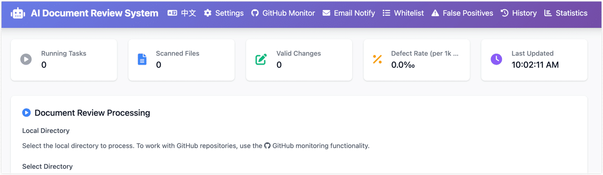
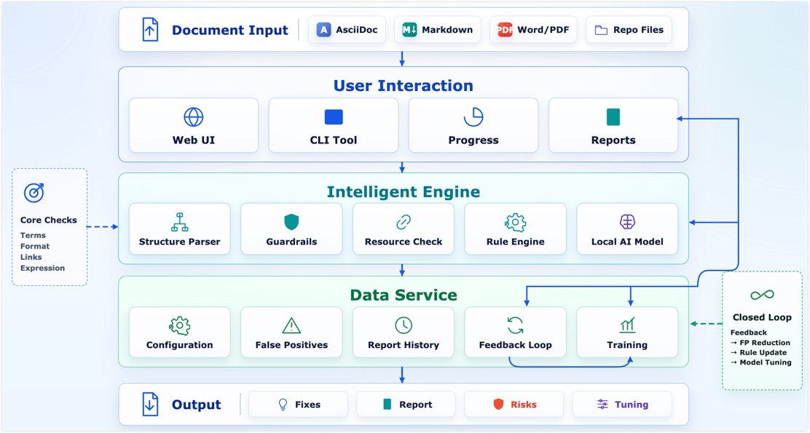
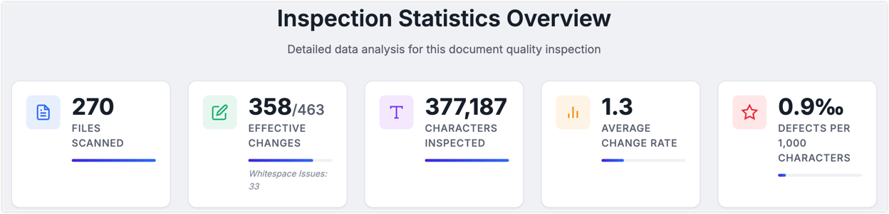

In my last post, [How I Review Technical Docs with AI](./ai-content-review-with-codex.md), I mentioned in passing that before bringing Codex into the workflow, I had already built a small local AI system for catching typos, terminology mistakes, basic awkward sentences, and the occasional formatting glitch.

It was a one-line aside, but a few readers wrote in asking for more. So this post zooms in on that piece: why a local AI content review system is worth building in the first place, how it differs from just calling a hosted LLM, and what it takes to go from a working demo to something a team will actually open every day.

<!--truncate-->

## Define Expectations Before Designing

If you just hand a folder of technical docs to a large model and tell it to "fix things," you are asking for trouble. Markdown gets mangled. Code blocks get "corrected." Variable names get translated. The damage is usually subtle and shows up days later in a broken page.

So the design principle here is the opposite of "throw AI at it." The system uses engineering — parsing, structure protection, scoping — to let AI do only what it is genuinely good at, while keeping it far away from the parts it would silently break. The goal is to free human reviewers from the repetitive scan work, not to replace their judgment.

In practice, this means the system is a **lightweight quality gate** that sits in front of the publishing pipeline, focused on a narrow set of jobs:

- Catch typos, repeated words, misspelled jargon, and obvious phrasing issues quickly
- Understand the structure of Markdown, AsciiDoc, code blocks, and config snippets
- Use whitelists and protection rules so it doesn't "fix" technical terms
- Keep scan progress, suggestions, reports, and config in one place
- Turn user feedback into rules, glossaries, and training data over time

Before going further, here is roughly what the result looks like, just so the next few sections aren't all walls of text:

:::tip

- This local system isn't the whole answer. As I described in the [previous post](./ai-content-review-with-codex.md), it is the first lightweight line of defense. Heavier work — context consistency, structural reasoning, bilingual translation checks — still goes to a stronger model like Codex during PR review. The two layers complement each other.
- I'm still cleaning up and de-sensitizing the codebase. Once that is done, the core pieces will land as an open-source project or example repo, so other teams with similar needs can fork and adapt it.

:::

## Why Not Just Use a Cloud LLM?

I asked myself the same question early on. Frontier LLMs are clearly capable. Why not just point one at the docs and be done?

A few weeks of trying it made the answer obvious.

**Cost.** A single document is cheap. A whole repo, scanned across many PRs and many versions, is not. Once you start paying cloud rates for every basic typo check, the bill scales linearly with your doc set, which is exactly the wrong direction.

**Data boundaries.** Technical docs casually contain unreleased features, internal architecture, customer scenarios, config samples, and troubleshooting notes. Even if a cloud provider's security story is solid, internal reviewers usually still need to decide what is safe to send out. For surface-level proofreading, doing it locally just removes the whole conversation.

**Reliability.** Doc review sits on the publishing path. If every scan depends on an external network, an external rate limit, and an external API that might change next quarter, the workflow gets fragile. Small local models have a lower ceiling, but a much higher floor.

**Right tool for the job.** Repeated words, common typos, terminology drift, spacing and punctuation — these don't need a frontier model. A rule engine plus a small local model handles them well. Save the strong AI for the genuinely hard problems: link consistency, claims that no longer match the product, subtle logical issues. That is a much better use of the budget.

## How Technical Doc Correction Differs from General Proofreading

When people think about technical content proofreading, the default mental model is "make the sentence sound better." That assumption falls apart fast in technical docs. A single page might mix:

- Markdown or AsciiDoc syntax
- YAML, JSON, SQL, or shell code blocks
- API names, parameter names, config keys, error codes
- Product terminology that mixes English and Chinese on purpose
- Image paths, internal links, and heading anchors
- Command output, log snippets, and config samples

Treat that page as ordinary prose and the model will helpfully turn `REST API` into `RESTFUL API`, edit comments inside code blocks as if they were plain text, or quietly break a Markdown table.

So from day one, the system has to answer three engineering questions before it touches a single sentence:

- Which content is safe to show the model?
- Which content must be locked down so it cannot be modified?
- How do we capture, track, and learn from the suggestions a human accepts or rejects?

## Architecture Design: From Proof-of-Concept to Self-Evolving System

The very first version was a CLI script: feed in some text, print suggestions, ship it. Good enough to validate the model and the basic idea, nowhere near good enough for a team.

The real challenge wasn't getting the model to fix a few typos. It was making the whole thing maintainable, extensible, and auditable while still keeping accuracy reasonable.

So the system slowly grew into a proper pipeline: parse the doc structure first, protect the sensitive bits (code, config, links, image paths), then run a rule engine and a small model in parallel, then feed the resulting reports and false-positive feedback back into the rules. A loop, not a one-shot script.

### 1. The Intelligent Engine Layer: Parsing, Protection, and Hybrid Diagnosis

This layer breaks the doc into pieces, protects the technical content, and produces clean text the diagnostic engines can safely look at.

**Step one: structure parsing and protection.** Technical proofreading starts with **structure**, not sentences. The system parses each file according to its type (Markdown, AsciiDoc, etc.) and identifies headings, paragraphs, code blocks, images, and so on. Then protection rules kick in:

- **Skip entirely**: fenced code blocks, YAML/JSON config, etc.
- **Local protection**: inline code, command paths, API parameter names, link and image targets.
- **Structure lock**: headings, tables, and admonitions stay syntactically intact.

**Step two: resource validation.** Content quality isn't only about wording — broken links and missing images quietly hurt trust too. Once the structure is parsed, a lightweight resource pass runs in parallel:

- **Link checking**: every internal and external link is resolved to make sure it isn't a 404 or a dead domain.
- **Image checking**: local relative-path images are verified to exist, and externally hosted images are pinged to make sure they still resolve. No more embarrassing broken-image icons.

**Step three: rules and a small model, working together.** With safe plain text in hand, two engines split the work:

- **Rule engine (deterministic problems)**: handles the high-frequency, well-defined stuff — repeated words, spacing and punctuation, fixed glossary terms. Fast, stable, and easy to reason about when something looks wrong.
- **Small AI model (semantic problems)**: handles awkward phrasing and contextual misuse that rules can't easily express. I tested several lightweight, Qwen-based models in the 1.5B to 4B parameter range. The selection criteria came down to a three-way trade-off: false-positive rate, response speed, and deployment cost. The final setup runs comfortably on consumer hardware like an RTX 3060 (12 GB).

:::tip Side note: a low-cost AI lab at home

Because the model is small, the entire prototype was built and run on my **home AI lab** — ordinary consumer hardware behind a Proxmox VE setup. If you'd like a separate post on how to put together a personal compute lab on a hobbyist budget, leave a comment and I'll dig into it.

:::

### 2. The Data Service Layer: False Positives and the Feedback Loop

The fastest way to lose users on a technical content AI review system is **false positives**. If the system keeps flagging your own product names as misspelled, people stop opening it within a week. So false-positive management isn't a polish task — it is what makes the difference between a demo and a tool people trust.

**False-positive management — defining the team's writing boundaries:**

- **Whitelist**: product names, component names, abbreviations — these get a free pass even if the model thinks they "look wrong."
- **Forced-fix rules**: terms that have been written incorrectly over and over get pinned as deterministic replacements.
- **Rejection-based filtering**: when a user dismisses a suggestion in the UI, that pattern feeds into the noise filter so the next scan is quieter.

**Feedback loop — every click becomes training data:**

The UI doesn't just have accept/reject buttons. Every action is recorded as a structured sample: the surrounding context, the model's suggestion, and what the human actually chose. That data has two uses:

1. **Same-week tuning** — high-frequency false positives roll straight into the whitelist or rule set and the noise drops the next day.
2. **Periodic fine-tuning** — once enough "what humans actually wanted" samples accumulate, the local small model gets a domain fine-tune. The goal isn't to make it a better generic technical content teacher. It is to make it more aware of the team's specific context (for example, lowering the model's confidence threshold around a few familiar technical phrasings).

### 3. The User Interaction Layer: Lowering the Usage Barrier

A CLI is fine for proving the idea works. It is not fine for technical writers and product folks who don't live in the terminal. So I built a small web UI on Flask and Tailwind CSS — a single `python start_web.py` brings it up locally.

The UI exists to get four things right:

- **Visual operation**: pick a doc directory or upload files, choose a config (debug mode, generate report), hit scan.
- **Real-time feedback**: a progress bar, a live log stream, and four always-visible numbers — files scanned, accepted edits, defects per thousand characters, and so on.
- **Config management**: skip patterns, whitelist, prompts — all editable in modal dialogs and saved through the UI, no YAML wrangling.
- **Reports and feedback**: when a scan finishes, you get an HTML diff view in the browser, a per-file defect breakdown, and one-click false-positive feedback that doubles as training data.

## Easily Overlooked Engineering Details

The three-layer architecture is the easy part to talk about. The harder part is the small, unglamorous engineering details that decide whether the system feels solid in daily use.

- **Lazy-load the model.** Don't let the web service eat your VRAM at startup. Keep the lightweight server online and only load the model when a scan actually starts.
- **Pin your dependencies.** AI libraries like `transformers` love to break compatibility between minor versions. Lock the core packages and have a fallback path so a single bad upgrade doesn't take the service down.
- **Tolerate parser failures in batch runs.** When you're scanning hundreds or thousands of files, one broken parse cannot kill the whole job. Isolate the failure, log it, and keep going.
- **Make the report drive the loop.** A report that only lists suggestions is missing the point. It should expose where defects cluster, and make accepting or rejecting suggestions a one-click action — because those clicks are exactly the high-quality samples your future fine-tuning runs need.

## How It Complements Codex Review

As I said up top, this local review system isn't the whole quality story. It's the first line — the cheap, fast pass that filters out the high-volume, easy-to-miss stuff.

Once typos and formatting noise are gone, the deeper review goes to a stronger model like Codex, which is much better at the things that actually need reasoning: context consistency, internal logic, multilingual alignment.

So the working setup splits AI review into two clear layers:

- **Pre-check (local small model)**: cheap, fast filtering on local hardware. On my test setup (RTX 3060, 12 GB) it processes **on the order of a hundred characters per second** of technical content.
- **Deep check (large model)**: kicks in at key moments like [PR submission](./ai-content-review-with-codex.md), and focuses on structure, context, and technical accuracy.

## Conclusion: Putting AI in the Right Place

Looking back at how the system evolved, I keep coming back to the same idea: AI's value isn't in replacing thinking. It's in freeing us up to think where it actually matters.

When the rule engine handles the deterministic stuff, the small model takes care of local phrasing and context, and a stronger model owns structure and logic, every layer is doing what it's good at. The win isn't only cost. The bigger win is that humans stop spending their attention on proofreading loops and get it back for the parts of writing that actually need judgment.

Real progress here comes from subtraction, not addition. Not "let AI do more," but "let AI do the parts that suit automation more reliably." Once the basics are quietly handled, people get the room to do the things that genuinely need experience and creativity.

This idea also lines up with what is increasingly being called **Harness Engineering** — not treating AI as an unbounded universal assistant, but putting it inside a controllable, verifiable workflow with rules, context, checks, and human escalation. What makes AI dependable in real work is rarely the raw model capability. It's whether the boundaries and feedback around it are well designed.

Whatever the models look like a year from now, I keep coming back to the same belief: real progress isn't about what AI **can** do. It's about whether we let AI do the things humans shouldn't have to do, well enough that the most valuable human work — judgment, creativity, taste — actually gets the time it deserves.

If you've been building your own version of this human-plus-AI loop, I'd love to hear what worked and what didn't.
