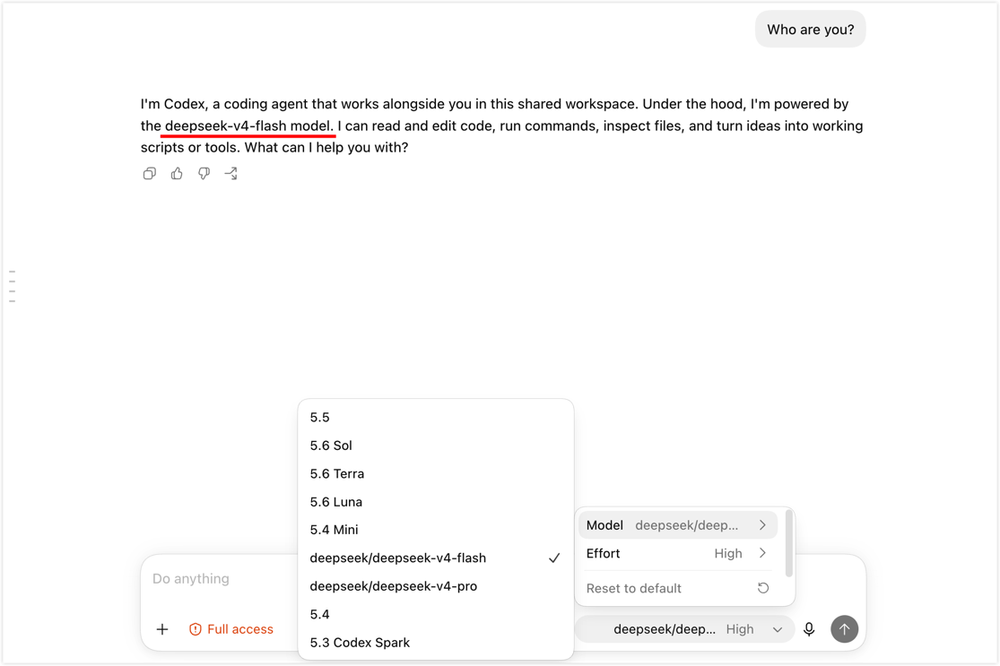

I often reach the same point in Codex Desktop: most of a task is done, only a few small edits remain, and I would rather finish with a faster, less expensive model.

DeepSeek V4 Flash can now connect directly to Codex through the Responses API. But when I previously changed providers, I ran into a different problem: the conversation still existed, but the original thread no longer appeared in the same place. I eventually used [opencodex](https://github.com/lidge-jun/opencodex) to manage model routing, which let me switch models and keep working in the current task. This post covers that setup and a few startup messages that are easy to misread.

<!--truncate-->

## Why I tried DeepSeek V4 Flash

I first paid attention to DeepSeek V4 Flash because of the benchmark data from [Artificial Analysis](https://artificialanalysis.ai/models/deepseek-v4-flash). The chart below is based on that data. It plots the cost of completing an Intelligence Index task on the horizontal axis and the overall score on the vertical axis. Farther left means a lower cost per task; higher means a better score.

In this snapshot from July 31, 2026, V4 Flash 0731 (max) stands out. It does not have the highest score, but it completes the same benchmark suite at a much lower cost. The chart cannot tell me whether it will work well with my codebase, but it gives me a good reason to put the model on my low-cost shortlist.


<p className="article-banner-caption">Based on Artificial Analysis Intelligence Index v4.1 data collected on July 31, 2026. Cost per Task is the benchmark cost, not the API token price.</p>

According to DeepSeek's documentation, V4 Flash supports a one-million-token context window and costs RMB 2 per million output tokens. Taken together, those numbers make it worth testing in Codex. Whether it is actually useful still depends on the code task. The [model overview](https://api-docs.deepseek.com/news/news260424/) and [pricing page](https://api-docs.deepseek.com/quick_start/pricing/) can also change, so check the current details before you start.

## DeepSeek connects directly to Codex—so why use opencodex?

DeepSeek V4 Flash now supports the Responses API natively. Follow the [official Codex integration guide](https://api-docs.deepseek.com/quick_start/agent_integrations/codex) to add the model catalog and provider configuration, and the Codex CLI, desktop app, and IDE extension can use DeepSeek without an extra protocol translation layer.

If you plan to use DeepSeek all the time, that is the simpler path. My workflow is closer to shifting gears midway through a task. I might start with one model for analysis, then move to DeepSeek for the remaining edits. Codex groups sessions by login method and provider identity, so changing the configuration can leave an existing thread intact but hidden from the current list.

That is why I moved to opencodex. Its local proxy manages provider routing and model-catalog sync in one place. With the default loopback setup, Codex continues using its native `openai` provider identity, so I do not have to keep replacing several configuration files when I switch models. For me, the important question is no longer whether Codex can call DeepSeek. It is whether I can switch models and keep working in the current task.

opencodex is not required to connect DeepSeek. It is a management layer for workflows that switch models often. It changes the local Codex configuration and model catalog, and requests pass through its local proxy. For details and recovery behavior, see the [opencodex Codex integration guide](https://opencodex.me/guides/codex-integration/).

This approach fits what I wanted: keep using Codex the same way, but switch the model behind it when needed.

## Set up opencodex

The steps below use opencodex `2.10.2`. The project currently requires Node.js 18 or later. Check your local version, then install the package with npm:

```bash
node -v
npm install -g @bitkyc08/opencodex
ocx --version
```

If npm explicitly reports that Bun's postinstall script was blocked, follow the guidance in the error. On my machine, I used:

```bash
npm install -g --allow-scripts=bun @bitkyc08/opencodex
```

This is not part of the normal installation. npm behavior varies by version, so read the full error before running it.

### Configure DeepSeek

After installation, run:

```bash
ocx init
```

Search for and select **DeepSeek** in the setup wizard, then enter the API key, default model, and proxy port:

- Create an API key in the [DeepSeek Platform](https://platform.deepseek.com/api_keys).
- This post uses `deepseek-v4-flash` as the model.
- Keep the default proxy port, `10100`.

Provider order and defaults can change between releases, so there is no need to remember where DeepSeek appears in the list. Before I run `ocx init`, I return Codex to its native configuration so another provider manager is not changing `config.toml` at the same time.

### Start the proxy

Start opencodex, then check its status:

```bash
ocx start
ocx status
```

Open `http://localhost:10100` in a browser to check whether DeepSeek is ready, which models were discovered, and which requests ran recently.


<p className="article-banner-caption">The opencodex Providers page in version 2.10.2.</p>

One quick caveat: opencodex is an independent community project. Requests pass through the local proxy before they reach the selected provider. Keep the dashboard and proxy port local unless you have configured remote access properly, and never commit API keys, account details, or request logs to a repository. Some providers also place restrictions on third-party proxies, so review their terms before connecting an account.

### Switch models in Codex Desktop

Return to Codex Desktop and open the model picker. You should see `deepseek/deepseek-v4-flash` with the provider prefix.



<p className="article-banner-caption">Switching to <code>deepseek/deepseek-v4-flash</code> in the same Codex Desktop thread.</p>

Once the setup is working, I rarely need to touch the configuration again.

## Startup messages that look like errors

These notes reflect the output I saw in version `2.10.2`. The wording may change in later releases. If your output differs, start with `ocx status` and `ocx doctor`.

- **`Previous session (PID xxxx) did not shut down cleanly.`**: The previous proxy session did not stop cleanly. Check the current status first. If the service is healthy, use `Ctrl+C` or `ocx stop` to shut it down normally next time.
- **`Provider model discovery ... omitted configured model ids`**: The live model catalog differs from older IDs in the local configuration. This usually does not mean the request failed; check the models currently returned by the provider.
- **`Codex app-server process(es) still running`**: A Codex background process is still using the old model catalog. Finish the active task, then run `ocx sync --restart-codex` so Codex reloads the catalog.
- **`Incomplete coverage: ... account(s) excluded`**: This message usually refers to account-pool or plan detection, not a broken DeepSeek connection. Check the active provider and request logs before treating it as an error.

I also tested the way back out. A connection tool that is easy to enable but hard to remove quickly becomes more trouble than it is worth.

## Restore native Codex

To stop a foreground proxy temporarily, press `Ctrl+C` in the terminal running `ocx start`. To stop the proxy and return Codex to its native configuration, run:

```bash
ocx stop
```

To restore the native Codex configuration while leaving the proxy process running, use:

```bash
ocx restore   # Alias: ocx eject
```

## Final thoughts

If I wanted to use DeepSeek all the time, I would start with the official Codex integration. It requires less configuration and avoids another local proxy. What makes opencodex useful to me is being able to switch models midway through a task, then return to my normal workflow without opening a new thread and explaining the entire context again.

V4 Flash's price and benchmark results gave me a reason to try it. I kept the setup because it reduced the interruption that normally comes with changing models. One of my basic tests for a model tool is now whether it lets me spend less time rebuilding context.
