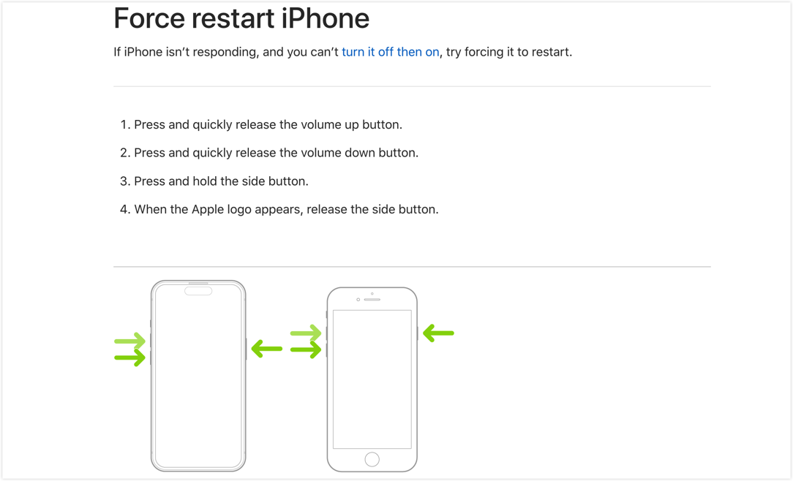
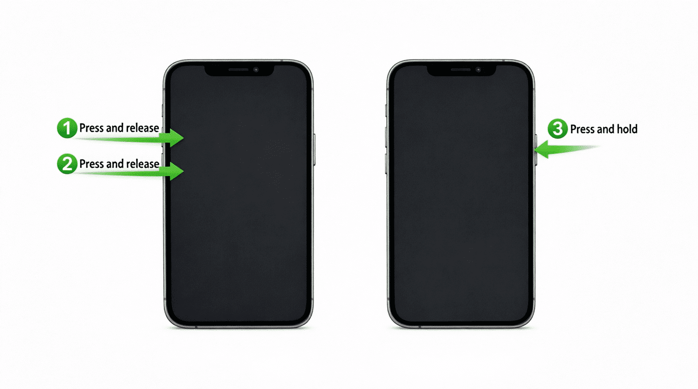
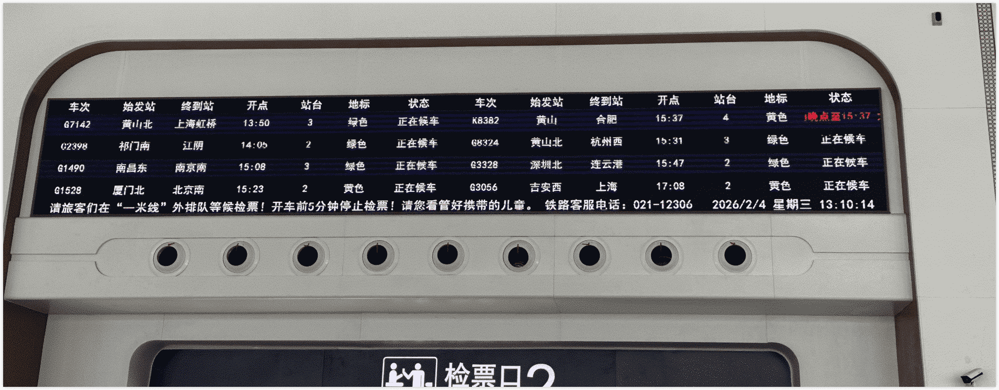
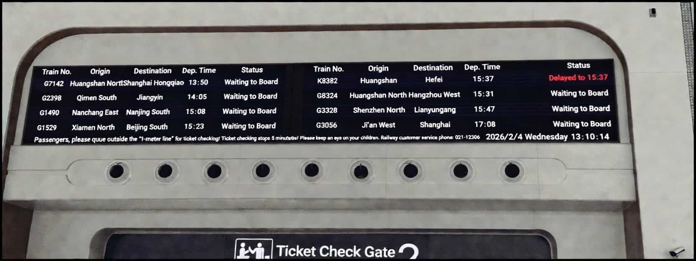
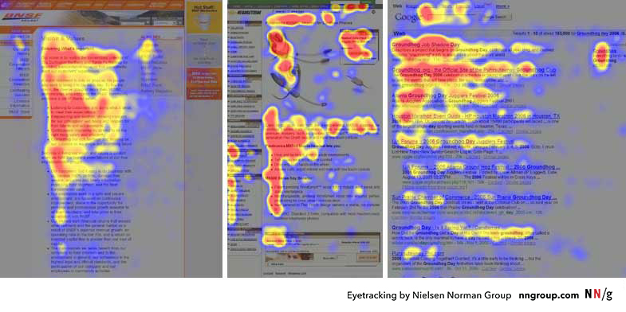
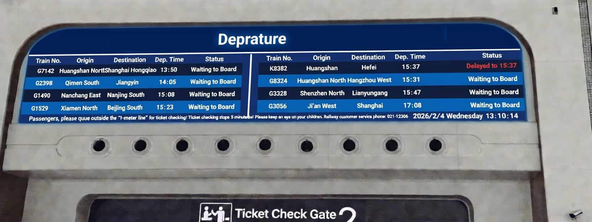
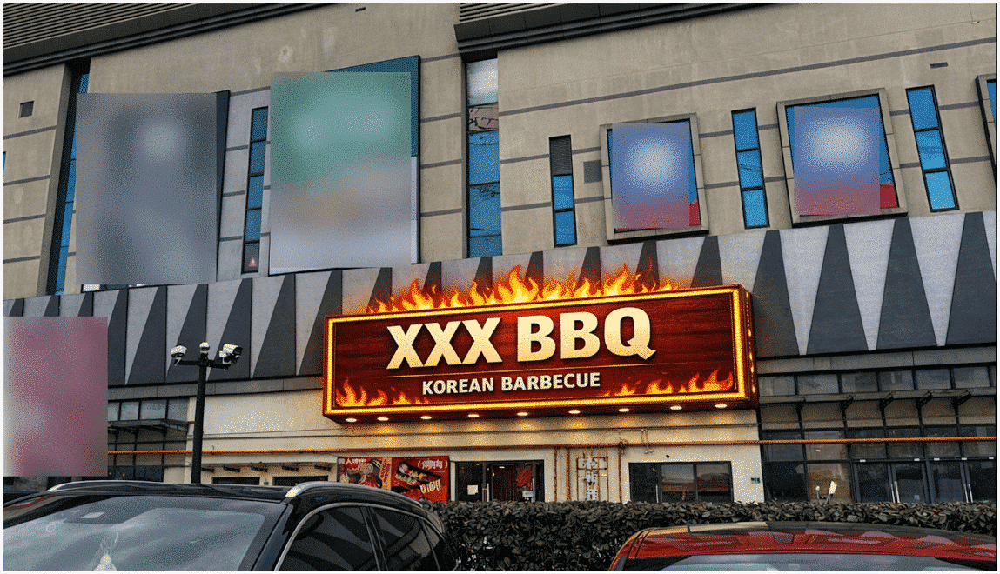

As a content creator, my entire job is turning complex information into clear, actionable content. After years of doing this, I’ve developed a serious occupational hazard: I can’t walk past a sign, a screen, or a website without instinctively judging how well (or poorly) the information is designed. It’s basically a reflex at this point.

Recently I ran into three perfect examples that drove the point home. Instead of diving into dry theory, I figured I’d share these everyday “gotchas” so we can all laugh at how easily we get tripped up — and remember to avoid the same mistakes in our own work.

<!--truncate-->

## Case 1: Apple’s Mysterious Color Puzzle

Last week a friend’s iPhone froze after lunch and he asked me how to force-restart it. I had no clue, so I pulled up Apple’s official support page. There was the usual diagram: two phones side by side with green arrows pointing to the volume-up button, volume-down button, and side power button. The arrows had a subtle gradient.

  Image from Apple’s website

I stared at it for a few seconds and still couldn’t figure out the order. I had to read the text to understand: quick press volume +, quick press volume -, then hold the side button. The three almost-identical green arrows made it super easy to assume you should press them all at once.

**The principle at play**: Visual Hierarchy

Visual hierarchy uses size, color, position, and numbering to guide people through importance or sequence. We naturally look at pictures first and treat text as backup (especially for accessibility). Relying on a tiny color shift to show order creates high cognitive load—people get lost fast (see Visme’s “12 Visual Hierarchy Principles”).

**Better approach**:
Just add 1, 2, 3 directly on the arrows or use numbered step illustrations. Clear guidance beats “pretty but confusing” every time.

I was lazy, so I fed my suggestion into an AI tool. Here’s the quick result:

  AI-enhanced version

## Case 2: The False Alarm Train Delay Scare

Early this year while I was in China at a high-speed rail station, the departure board nearly gave me a heart attack. My train—G1742, the very first row—showed an expected arrival of 13:50. My eyes flicked right and landed on big red “delayed until 15:37” text. I panicked and double-checked before realizing the delay belonged to a completely different train on the same screen.

  Photo I took at the station

To help better understand, I have organized a corresponding English version based on the image above:

I was standing near the ticket gate and overheard at least five or six people rushing over to staff asking, “Is my train (G1742) delayed?” The poor attendants were losing their minds.

High-speed rail stations are noisy, crowded, and people are usually in a hurry with limited viewing angles—so information has to be crystal clear and interference-proof.

**The principles at play**: F-pattern reading + Gestalt Proximity

- **F-pattern reading**: Nielsen Norman Group’s eye-tracking studies show people scan lists and tables in an F-shape: quick horizontal sweeps across the top lines, then a vertical scan down the left side. In dense tables it’s easy to “connect” everything in one row without realizing it’s two separate records (full article: https://www.nngroup.com/articles/f-shaped-pattern-reading-web-content-discovered/).

  From Nielsen Norman Group eye-tracking research

- **Gestalt proximity principle**: elements that are visually close get grouped together by our brains. No separator line = instant confusion.

**Better approach**:
Add a simple thin vertical line between the two trains’ info, or use background shading/spacing. Public displays have sky-high misread costs—one line saves everyone a ton of hassle. The staff I chatted with loved the idea. Here’s the quick mock-up:

  Adjusted version

:::tip

Of course you can go further—extra row spacing, color-coding landmarks to match text, subtle table borders, etc. But right now a single vertical line is the simplest, fastest win.

:::

## Case 3: The Invisible Grilled-Meat Sign

Weekend grocery run in China: I walked past a shopping mall and spotted an “XXX Grilled Meat” sign on the outer wall. Something felt off. White lettering on an off-white wall, yellow metal supports that perfectly blended with the building’s yellow pipes, plus some greenery blocking the view. From a distance in daylight you could barely read it—or even tell there was a restaurant there at all. Just a few ghostly letters floating behind some pipes.

I stepped back and snapped a photo. Can you spot the sign right away?

  Photo I took outside a shopping mall in China

It’s literally in the center of the frame, yet most people miss it. Sure, it probably lights up beautifully at night with all those LED bulbs, but daytime foot traffic matters too!

**The principle at play**: Contrast

Contrast is the most basic (and critical) rule in visual design. Information must be readable in every lighting condition. WCAG 2.2 requires at least 4.5:1 contrast for text. White-on-white lettering plus yellow-on-yellow supports made the whole thing disappear.

**Better approach**:
Switch to high-contrast colors. Restaurants (especially barbecue and hotpot spots) love bold red and yellow because they trigger appetite. A commercial sign’s number-one job is to be seen, not just look good under specific lights.

I’m no sign designer, so I asked my AI buddy to mock one up. It’s a little kitschy, but at least you can actually read it now:

  Quick AI mock-up

## Wrap-up: Tiny Details, Huge Impact

Three completely different scenarios—tech giant, public transport, and a local eatery—yet all tripped over the same core issue: information design details matter a lot. They have to respect real-world environments and how human brains actually work.

A simple number, one divider line, or a contrast tweak can prevent countless misunderstandings. As someone who makes a living communicating clearly, these examples constantly remind me that good design isn’t just a skill—it’s basic respect for people’s time and sanity.

Have you bumped into any sneaky information design traps lately? Which principle do you think gets ignored the most? Drop a comment below—let’s make the world’s information a little friendlier together! 😄